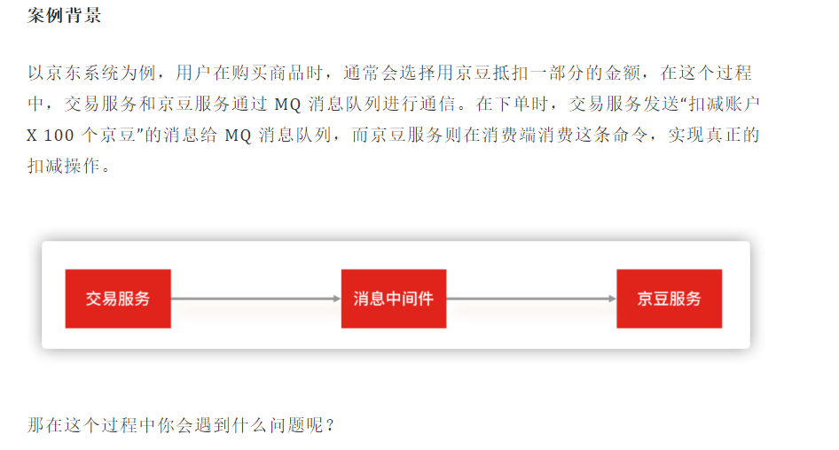

### 案例背景
   

### 案例分析
我们平常引入消息中间件，最直接的目的，做系统解耦和流量控制，追其根源还是为了解决互联网系统的高可用和高性能问题

* 系统解耦：
  用 MQ 消息队列，可以隔离系统上下游环境变化带来的不稳定因素，比如京豆服务的系统需求无论如何变化，交易服务不用做任何改变，即使当京豆服务出现故障，主交易流程也可以将京豆服务降级，实现交易服务和京豆服务的解耦，做到了系统的高可用。
* 流量控制：
  遇到秒杀等流量突增的场景，通过 MQ 还可以实现流量的“削峰填谷”的作用，可以根据下游的处理能力自动调节流量。
  不过引入 MQ 虽然实现了系统解耦合流量控制，也会带来其他问题。

**引入 MQ 消息中间件实现系统解耦，会影响系统之间数据传输的一致性。** 在分布式系统中，如果两个节点之间存在数据同步，就会带来数据一致性的问题。同理，在这一讲你要解决的就是：消息生产端和消息消费端的消息数据一致性问题（也就是如何确保消息不丢失）。

**而引入 MQ 消息中间件解决流量控制**， 会使消费端处理能力不足从而导致**消息积压**，这也是你要解决的问题。

所以你能发现，问题与问题之间往往是环环相扣的，面试官会借机考察你解决问题思路的连贯性和知识体系的掌握程度。

那面对“在使用 MQ 消息队列时，如何确保消息不丢失”这个问题时，你要怎么回答呢？首先，你要分析其中有几个考点，比如：

* 如何知道有消息丢失？

* 哪些环节可能丢消息？

* 如何确保消息不丢失？

候选人在回答时，要先让面试官知道你的分析思路，然后再提供解决方案：网络中的数据传输不可靠，想要解决如何不丢消息的问题，首先要知道哪些环节可能丢消息，以及我们如何知道消息是否丢失了，最后才是解决方案（而不是上来就直接说自己的解决方案）。就好比“架构设计”“架构”体现了架构师的思考过程，而“设计”才是最后的解决方案，两者缺一不可。

   