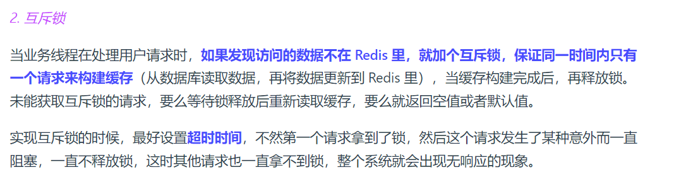
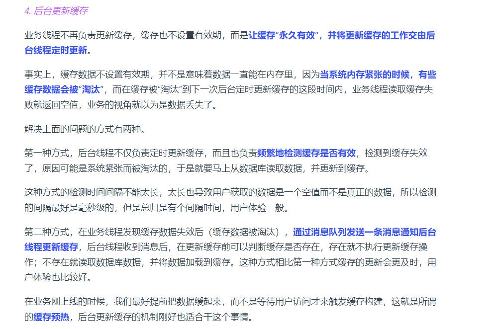

内存淘汰的时候用redis默认淘汰惰性配合定时淘汰的时候，随机抽取20个数据出来看是否是过期的，如果是过期的就删掉，这种情况也是会产生类似缓存雪崩缓存击穿这种问题   

万变不离其中，这样问无非也是问缓存雪崩或者缓存击穿的问题罢了 

第一种情况就是使用互斥锁，让业务线程（客户端）去更新缓存，保证同一时间只有一个请求来构建缓存（从数据库中读取数据，然后将数据更新到redis中，这个过程需要加锁保证数据更新的正确性。    

第二种情况是使用后台更新缓存： （前提条件:当业务线程不去使用互斥锁的时候）  

      

