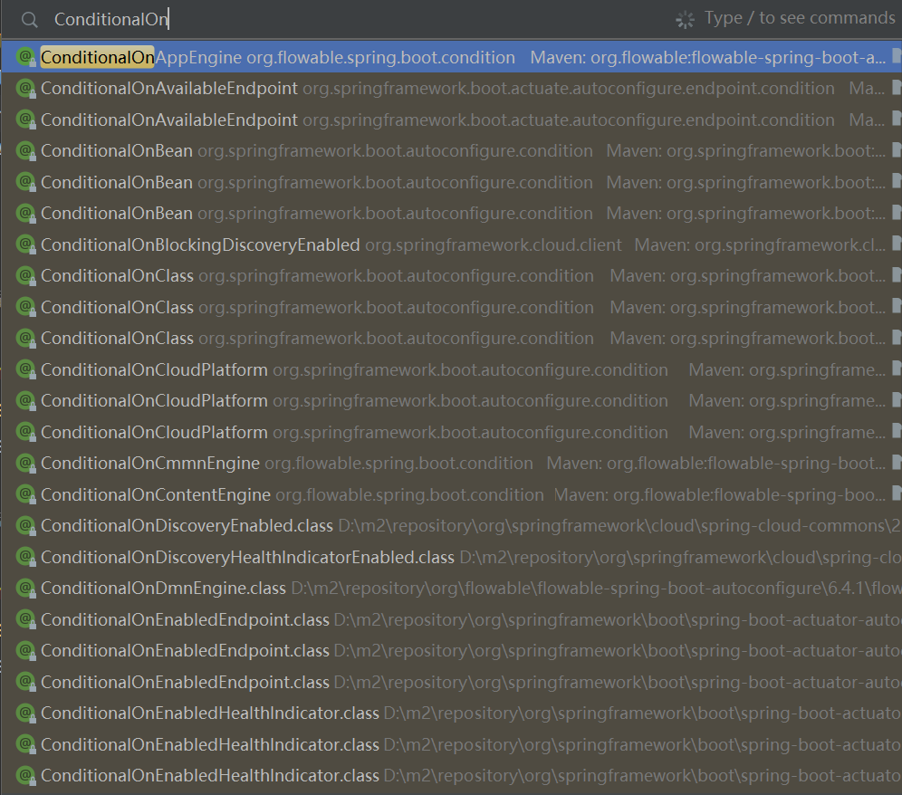
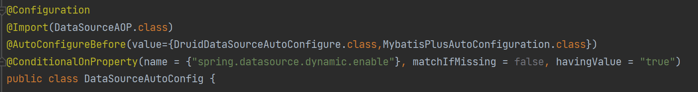
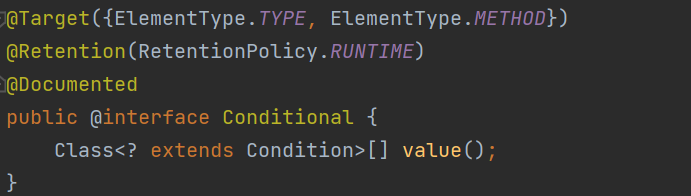
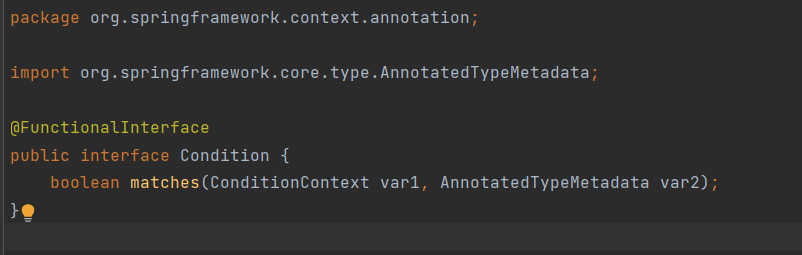

# Spring Boot

# 常用注解  
# 1. @Conditional     
@Conditional注解是从Spring4.0才有的，可以用在任何类型或者方法上面，通过@Conditional注解可以配置一些条件判断，当所有条件都满足的时候，被@Conditional标注的目标才会被Spring容器处理     
@Conditional的使用很广，比如控制某个Bean是否需要注册，在Spring Boot中的变形很多，比如@ConditionalOnMissingBean、@ConditionalOnBean等等，如下：    
    
像我项目就用到了@ConditionalOnProperty   
   

这个注解的源码如下：  
    
只有一个属性value，表示判断的条件(一个或多个)   
注解实现的原理很简单，就是通过org.springframework.context.annotation.Condition这个接口判断是否应该执行操作      

好了既然说到了spring源码中的Condition，那就看看Condition吧    
    
可以看到这是个函数式接口，位于spring-context模块下   

# 自动装配顺序  

# 自动装配原理  
