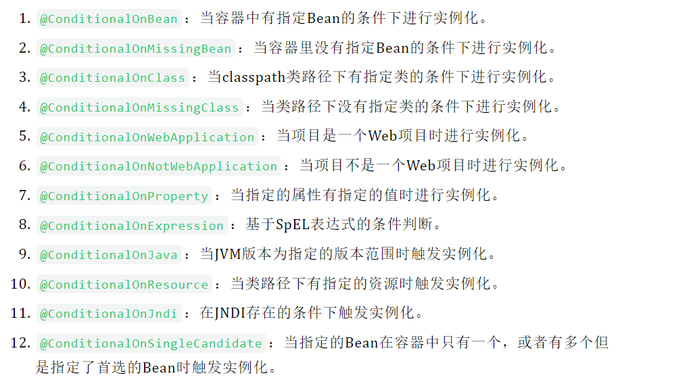
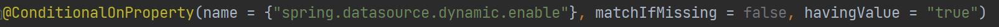
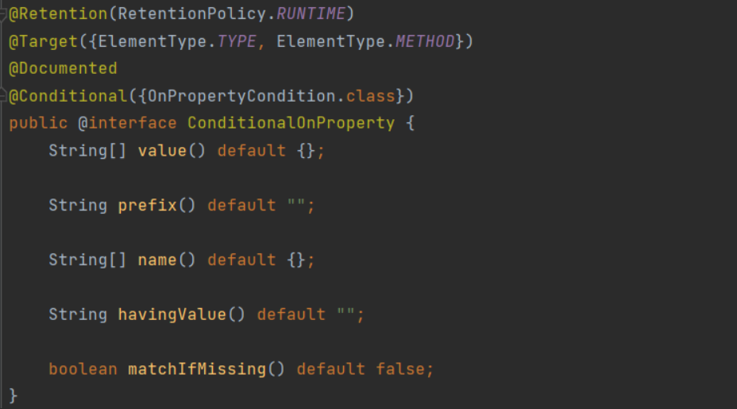
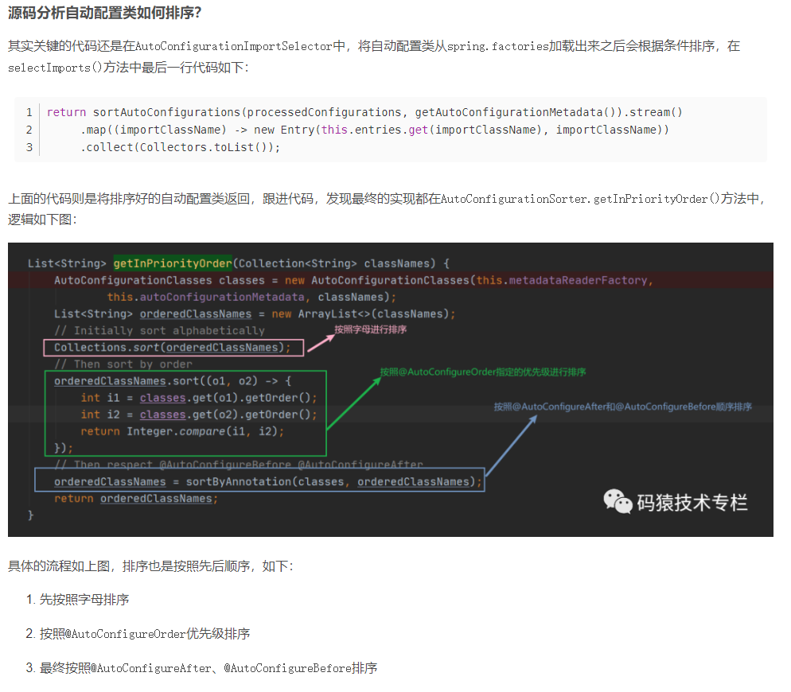
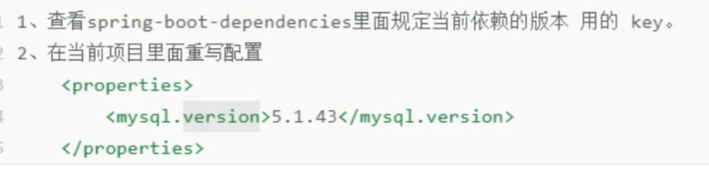
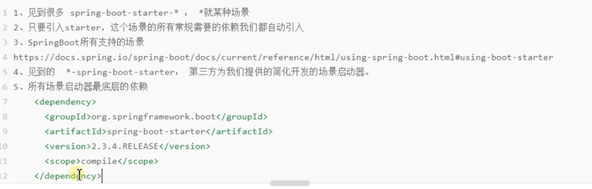
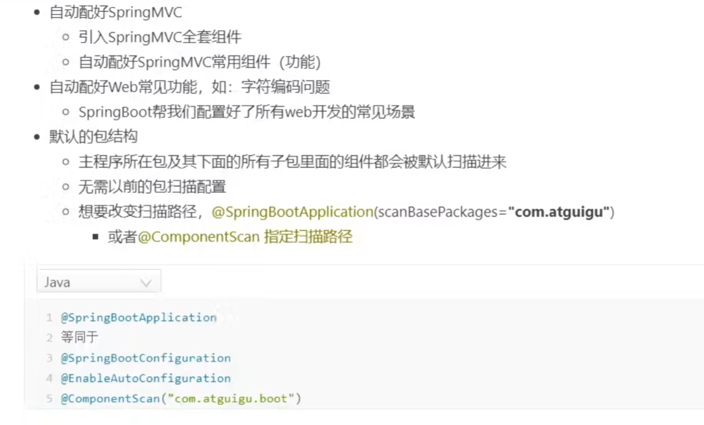
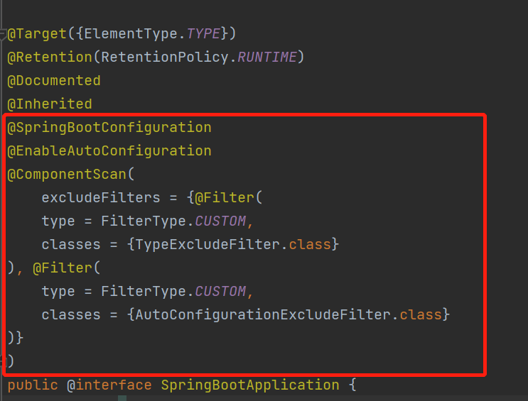

# Spring Boot

----  

# 常用注解  
# 1. @Conditional     
@Conditional注解是从Spring4.0才有的，可以用在任何类型或者方法上面，通过@Conditional注解可以配置一些条件判断，当所有条件都满足的时候，被@Conditional标注的目标才会被Spring容器处理     
@Conditional的使用很广，比如控制某个Bean是否需要注册，在Spring Boot中的变形很多，比如@ConditionalOnMissingBean、@ConditionalOnBean等等，如下：    
    
像我项目就用到了@ConditionalOnProperty   
   

----

这个注解的源码如下：  
    
只有一个属性value，表示判断的条件(一个或多个)   
注解实现的原理很简单，就是通过org.springframework.context.annotation.Condition这个接口判断是否应该执行操作      

----

好了既然说到了spring源码中的Condition，那就看看Condition吧    
    
可以看到这是个函数式接口，位于spring-context模块下,其中有一个matches方法，返回true表示条件成立，反之不成立    
var1: 条件上下文，可以用来获取容器的上下文信息    
var2: 用来获取被@Conditional标注的对象上的所有注解信息       

深入了解第一个参数的类，ConditionContext:  
```java
public interface ConditionContext {

    /**
     * 返回bean定义注册器，可以通过注册器获取bean定义的各种配置信息
     */
    BeanDefinitionRegistry getRegistry();

    /**
     * 返回ConfigurableListableBeanFactory类型的bean工厂，相当于一个ioc容器对象
     */
    @Nullable
    ConfigurableListableBeanFactory getBeanFactory();

    /**
     * 返回当前spring容器的环境配置信息对象
     */
    Environment getEnvironment();

    /**
     * 返回资源加载器
     */
    ResourceLoader getResourceLoader();

    /**
     * 返回类加载器
     */
    @Nullable
    ClassLoader getClassLoader();
}
```
    
----  
如何自定义Condition   


----
 
常用的Confition注解   



比如在WEB模块的自动配置类WebMvcAutoConfiguration下有这样一段代码：   
```java
  @Bean
  @ConditionalOnMissingBean
  public InternalResourceViewResolver defaultViewResolver() {
   InternalResourceViewResolver resolver = new InternalResourceViewResolver();
   resolver.setPrefix(this.mvcProperties.getView().getPrefix());
   resolver.setSuffix(this.mvcProperties.getView().getSuffix());
   return resolver;
  }   
```
常见的@Bean和@ConditionalOnMissingBean注解结合使用，意思是当容器中没有InternalResourceViewResolver这种类型的Bean才会注入。这样写有什么好处呢？好处很明显，可以让开发者自定义需要的视图解析器，如果没有自定义，则使用默认的，这就是Spring Boot为自定义配置提供的便利   

----  

# 2.@ConditionalOnProperty  

open-capacity-platform项目中用到了@ConditionalOnProperty,深入学习下     
     

在spring boot中有时候需要控制配置类是否生效,可以使用@ConditionalOnProperty注解来控制@Configuration是否生效   

源码：  
    

@ConditionalOnProperty   
1、name或value是必填项    
2、matchIfMissing：当未找到对应配置是否匹配(默认不匹配)    
3、常用组合：   
(prefix)+name+havingValue 判断是否包含某属性且属性值与havingValue一致    
(prefix)+value 判断是否包含所有value   


来看应用场景：   
* springboot的自动装配中就大量运用到了这个    
* @EnableScheduling,定时任务，开发环境不想让他一直运行   
类上添加注解，然后配置文件中将是否定时任务的配置改为false，这样就能关闭定时任务     
@ConditionalOnProperty(name = "task.enable", havingValue = "true")   
* 多个配置文件通过这个控制具体读取哪个     

总结：  
通过@ConditionalOnProperty控制配置类是否生效,可以将配置与代码进行分离,实现了更好的控制配置    
@ConditionalOnProperty实现是通过havingValue与配置文件中的值对比,返回为true则配置类生效,反之失效       

----


# 3. @ConfigurationProperties   
@ConfigurationProperties是springboot提供读取配置文件的一个注解。其对应的bean的后置处理器为
ConfigurationPropertiesBindingPostProcessor   

在bean被实例化后，会调用后置处理，递归的查找属性，通过反射注入值，对大多数属性而言强制需提供其setter和getter方法    

# 4.@AutoConfigurexxx   
#### @AutoConfigureAfter
当前配置类在指定配置类之后执行


用在自动配置类上面，表示该自动配置类需要在另外指定的自动配置类配置完之后。   

如 Mybatis 的自动配置类，需要在数据源自动配置类之后。    
```java
@AutoConfigureAfter(DataSourceAutoConfiguration.class)
public class MybatisAutoConfiguration {
``` 

#### @AutoConfigureOrder
指定优先级，数值越小，优先级越高。


    


# 自动装配顺序  


----
---- 
# 自动装配原理  


# Springboot操作     

### springboot的一些便利地方   
因为springboot-starter依赖就包含了很多平常使用的依赖并且指定了版本，如果你要自定义版本号，就参考以下示例(将mysql8.0依赖改成自己想要的)    
步骤：   如果发现和包的版本不一样就手动更改   
    
实例：  
       
   

开发的时候主要是引入springboot-starter-*，这样就有一整套依赖了   
    
   
     


    

@SpringBootApplication的部分源代码         
    


    
自动配置是按需加载的，你pom有什么，他才加载什么    