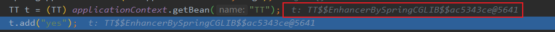
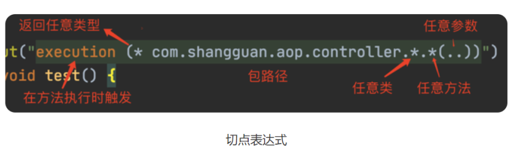

# stereotyped-writing

这是关于Spring的面试笔记，即是八股文又不是八股文   
笔记涉及大量源码和原理，初学者看起来可能会吃力

对一些基本概念过一下就好，真正重要的是一些平常没注意的知识点   

**注意：以下关于IOC AOP的实现方式通通用的是SpringBoot的注解方式实现的，配置就用配置类，而不是基于原始的XML的内部bean外部bean等方式**

# 基础概念的面试题


# 面试重点：循环依赖
这个知识点被问烂了，必须掌握    


# IOC       


# AOP  ： Aspect Oriented Programming，面向切面编程
### AOP概念概念：
将一些通用的逻辑集中实现，然后通过 AOP 进行逻辑的切入，减少了零散的碎片化代码，提高了系统的可维护性。

具体是含义可以理解为：通过代理的方式，在调用想要的对象方法时候，进行拦截处理，执行切入的逻辑，然后再调用真正的方法实现。

### 一些基本概念
1.通知(Advice)

通知定义了在切入点代码执行时间点附近需要做的工作。

Spring支持五种类型的通知：     
Before(前)  org.apringframework.aop.MethodBeforeAdvice   
After-returning(返回后) org.springframework.aop.AfterReturningAdvice    
After-throwing(抛出后) org.springframework.aop.ThrowsAdvice    
Arround(周围) org.aopaliance.intercept.MethodInterceptor   
Introduction(引入) org.springframework.aop.IntroductionInterceptor     

2.连接点(Joinpoint)

程序能够应用通知的一个“时机”，这些“时机”就是连接点，例如方法调用时、异常抛出时、方法返回后等等。

3.切入点(Pointcut)

通知定义了切面要发生的“故事”，连接点定义了“故事”发生的时机，那么切入点就定义了“故事”发生的地点，例如某个类或方法的名称，Spring中允许我们方便的用正则表达式来指定。

4.切面(Aspect)

通知、连接点、切入点共同组成了切面：时间、地点和要发生的“故事”。

5.引入(Introduction)

引入允许我们向现有的类添加新的方法和属性(Spring提供了一个方法注入的功能）。

6.目标(Target)

即被通知的对象，如果没有AOP，那么通知的逻辑就要写在目标对象中，有了AOP之后它可以只关注自己要做的事，解耦合！

7.代理(proxy)

应用通知的对象，详细内容参见设计模式里面的动态代理模式。

8.织入(Weaving)，AOP是在运行时注入的，动态代理   

把切面应用到目标对象来创建新的代理对象的过程，织入一般发生在如下几个时机:

(1)编译时：当一个类文件被编译时进行织入，这需要特殊的编译器才可以做的到，例如AspectJ的织入编译器；

(2)类加载时：使用特殊的ClassLoader在目标类被加载到程序之前增强类的字节代码；

(3)运行时：切面在运行的某个时刻被织入,SpringAOP就是以这种方式织入切面的，原理应该是使用了JDK的动态代理技术

### AOP使用场景 
日志，权限，监控，事务，异常等


## AOP的动态代理分两类
Spring官网默认是jdk动态代理       
在SpringBoot2.x之后，aop默认的动态代理方式是CGLIB
    
如果要修改 SpringBoot 使用 JDK 动态代理，那么在配置文件里设置 spring.aop.proxy-target-class=false    
至于为什么要换成CGLIB是因为jdk动态代理要求接口，没接口会报错，为了舒服就改成动态代理了，反正功能也没什么影响    


### jdk动态代理：  必须实现接口，核心是InvocationHandler接口和Proxy类
###### 实现方式
```java
//定义接口
public interface UserService {
    public void addUser(String username,String password);


    public void deleteUser(String username);
}
//定义要代理的对象
public class UserImpl implements  UserService{
    @Override
    public void addUser(String username, String password) {
        System.out.println("新增用户的方法");
    }

    @Override
    public void deleteUser(String username) {
        System.out.println("删除用户的方法");
    }
}


// 定义切面类，通过Proxy得到代理类，把所有接口方法的调用转发到InvocationHandler接口的invoke()方法上，然后根据反射调用目标类的方法


```

**aop的通知配置**   
首先了解切入点表达式  
   

然后了解五种注解类型
@Before : 前置通知，在方法执行之前执行
@After : 后置通知，在方法执行之后执行
@AfterRunning : 返回通知，在方法返回结果之后执行
@AfterThrowing : 异常通知，在方法抛出异常之后
@Around : 环绕通知，围绕着方法执行


```java
@Configuration
@Aspect
public class SpringAOPConfig{
    
    /**
     * @param joinPoint
     * @Before：前置通知
     * value：切入点表达式  二者加起来构建成为一个切面
     * JoinPoint：连接点：可以理解为两个圆形的切点，从这个切点就可以获取到当前执行的目标类及方法
     * 前置通知和后置通知的参数的都是 JoinPoint， 前置后置通知都没有返回值
     */
    //在目标方法执行前进行切入
    // 方法级别：具体到某个具体的方法
    // @Before(value = "execution(* com.liu.aop.service.impl.*.*(..))")
    // 表示service包下的所有类所有方法都执行该前置通知
    @Before("execution(* springTest.*.*(..))")
    public void before(JoinPoint joinPoint) {
        System.out.println("方法执行之前执行");
        System.out.println("正在执行的目标类是: " + joinPoint.getTarget());
        System.out.println("正在执行的目标方法是: " + joinPoint.getSignature().getName());
    }
    
    /**
     * 后置通知，属性参数同上面的前置通知
     * @param joinPoint 前置通知和后置通知独有的参数
     */
    @After("execution(* springTest..*.*(..))")
    public void After(JoinPoint joinPoint) {
        System.out.println("方法执行之后执行");

    }
    
    /**
     * @param proceedingJoinPoint 环绕通知的正在执行中的连接点（这是环绕通知独有的参数）
     * @return 目标方法执行的返回值
     * @Around: 环绕通知，有返回值，环绕通知必须进行放行方法（就相当于拦截器），否则目标方法无法执行
     */
    @Around(value = "execution(* springTest.*.*(..))")
    public Object around(ProceedingJoinPoint proceedingJoinPoint) throws Throwable {

        System.out.println("Around");

        //将目标方法的返回值返回，否则调用该目标方法的方法无法获取到返回值
        return  proceedingJoinPoint.proceed();
    }

}
```


###### 实现原理  
* 1.首先通过实现一个InvocationHandler接口得到一个切面类    
* 2.利用Proxy糅合目标类的类加载器、接口和切面类得到一个代理类   
* 3.代理类的逻辑就是执行切入逻辑，把所有接口方法的调用转发到InvocationHandler的invoke()方法上，然后根据反射调用目标类的方法     

###### 源码解析

### CGLIB动态代理
###### 实现方式


###### 实现原理
    
###### 源码解析   


## 动态代理注意事项 
* 1.不能出现private和final，尤其是final，禁止
* 2.实现了接口默认是用jdk动态代理，当然也可以强制使用CGLIB
* 3.没实现接口就必须用CGLIB了


# 面试难点：能说说拦截连的实现吗


