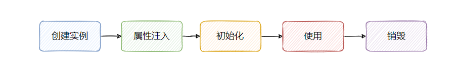
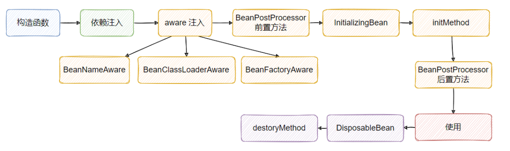
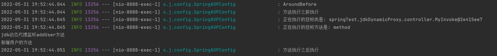
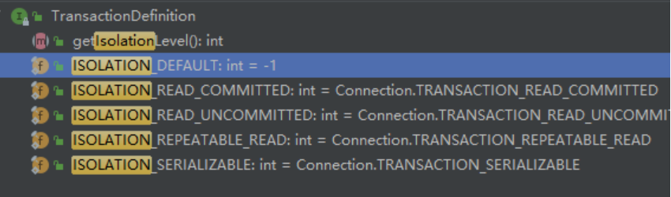
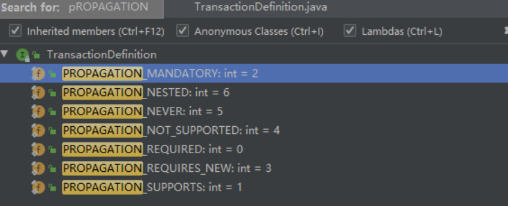
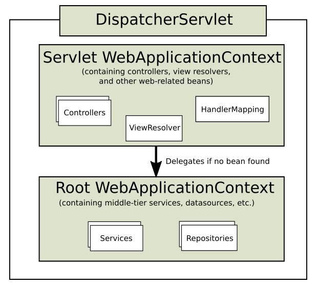

# stereotyped-writing
# Spring
笔记涉及大量源码和原理，初学者看起来可能会吃力   
为了方便录友学习，我会用一些口语化语言去描述         

内容大概如下：
* 1. 生命周期
* 2. 循环依赖
* 3. IOC容器和AOP动态代理的两种实现方式，jdk动态代理和CGLIB的实现加原理加深度源码分析
* 4. 拦截链详解
* 5. Spring事务 
* 6. Spring Aware的使用和原理 
* 7. SpringMVC
* 8. Spring设计模式

----

先来点概念题   
# 概念面试题  

----
###### 1. 什么是Spring?    
可以从两个层面来理解 Spring。

第一个层面指的是 Spring Framework，是一个开源的应用框架，提供 IOC 和 AOP 降低了应用开发的复杂度。

第二个层面指的是 Spring 全家桶，Spring 发展到今天可以说几乎是统领了 Java，有关 Java 应用开发所需的全部功能， Spring 都提供了解决方案。

包括对批处理的支持、对 web 的支持、对微服务的支持等。 

----

###### 2. Spring由哪些重要的模块组成  
Spring 最主要的核心就是一个容器，这个容器根据我们的配置文件创建了各种 Bean 且编织它们之间的依赖关系，管理这些 Bean 的生命周期
* spring-core: 核心库，一些工具类
* spring-beans: 对Bean的支持，包括控制反转和依赖注入，BeanFactory就在这个模块下
* spring-context: 上下文，支持数据验证、国际化、事件传播等，ApplicationContext在里面
* spring-aop：AOP 的支持
* spring-jdbc：jdbc 的支持
* spring-orm: orm 的支持
* spring-webmvc: mvc 的支持
----


----

首先我们来聊聊Bean的生命周期
# Spring Bean的生命周期   
简略图：  
   
+详细图：
  

相同颜色代表相同的一个过程   


2. 


3.   


----

# 循环依赖
这个知识点被问烂了，必须掌握    


----

# IOC       

######  什么是IOC?
IOC就是控制反转，首先知道控制指的是控制对象的创建，IOC 容器根据配置文件来创建对象，在对象的生命周期内，在不同时期根据不同配置进行对象的创建改造    
反转的是关于创建对象且注入依赖对象的这个动作，本来这个动作是由我们程序员在代码里面指定的，比如依赖注入，是需要我们自己去指定代码的，比如A依赖B，那么我们需要在A里面先手动创建B才能创建完整的A       
反转以后上述程序员   的行为由IOC容器触发，IOC 容器在创建对象 A 的时候，发现依赖对象 B ，根据配置文件，它会创建 B，并将对象 B 注入 A 中，注入的不一定要是对象，也能是属性

###### IOC有什么好处?
对象的创建都由 IOC 容器来控制之后，对象之间就不会有很明确的依赖关系，使得非常容易设计出松耦合的程序。

例如，对象 A 需要依赖一个实现，但是对象都由 IOC 控制之后，我们不需要明确地在对象 A 的代码里写死依赖的实现。

例如只需要写明依赖一个接口，这样我们的代码就能顺序的编写下去。

然后，我们可以在配置文件里定义 A 依赖的具体的实现（比如 B），根据配置文件，在创建 A 的时候，IOC 容器就知晓 A 依赖的 B，这个注入这个依赖即可。

如果之后你有新的实现需要替换，那 A 的代码不需要任何改动，你只需要将配置文件 A 依赖 B 改成 B1，这样重启之后，IOC 容器会为 A 注入 B1。

这样就使得类 A 和类 B 解耦了， very nice！

并且也因为创建对象由 IOC 全权把控，那么我们就能很方便的让 IOC 基于扩展点来“加工”对象。

例如我们要代理一个对象，IOC 在对象创建完毕，直接判断下这个对象是否需要代理，如果要代理，则直接包装返回代理对象。

这等于我们只要告诉 IOC 我们要什么，IOC 就能基于我们提供的配置文件，创建符合我们需求的对象。

正是这个控制反转的思想，解放了我们的双手。


----

# AOP  ： Aspect Oriented Programming，面向切面编程
### AOP概念概念：
将一些通用的逻辑集中实现，然后通过 AOP 进行逻辑的切入，减少了零散的碎片化代码，提高了系统的可维护性。

具体是含义可以理解为：通过代理的方式，在调用想要的对象方法时候，进行拦截处理，执行切入的逻辑，然后再调用真正的方法实现。

### 一些基本概念
1.通知(Advice)

通知定义了在切入点代码执行时间点附近需要做的工作。

Spring支持五种类型的通知：     
Before(前)  org.apringframework.aop.MethodBeforeAdvice   
After-returning(返回后) org.springframework.aop.AfterReturningAdvice    
After-throwing(抛出后) org.springframework.aop.ThrowsAdvice    
Arround(周围) org.aopaliance.intercept.MethodInterceptor   
Introduction(引入) org.springframework.aop.IntroductionInterceptor     

2.连接点(Joinpoint)

程序能够应用通知的一个“时机”，这些“时机”就是连接点，例如方法调用时、异常抛出时、方法返回后等等。

3.切入点(Pointcut)

通知定义了切面要发生的“故事”，连接点定义了“故事”发生的时机，那么切入点就定义了“故事”发生的地点，例如某个类或方法的名称，Spring中允许我们方便的用正则表达式来指定。

4.切面(Aspect)

通知、连接点、切入点共同组成了切面：时间、地点和要发生的“故事”。

5.引入(Introduction)

引入允许我们向现有的类添加新的方法和属性(Spring提供了一个方法注入的功能）。

6.目标(Target)

即被通知的对象，如果没有AOP，那么通知的逻辑就要写在目标对象中，有了AOP之后它可以只关注自己要做的事，解耦合！

7.代理(proxy)

应用通知的对象，详细内容参见设计模式里面的动态代理模式。

8.织入(Weaving)，AOP是在运行时注入的，动态代理   

把切面应用到目标对象来创建新的代理对象的过程，织入一般发生在如下几个时机:

(1)编译时：当一个类文件被编译时进行织入，这需要特殊的编译器才可以做的到，例如AspectJ的织入编译器；

(2)类加载时：使用特殊的ClassLoader在目标类被加载到程序之前增强类的字节代码；

(3)运行时：切面在运行的某个时刻被织入,SpringAOP就是以这种方式织入切面的，原理应该是使用了JDK的动态代理技术

----

### AOP使用场景 
日志，权限，监控，事务，异常等

----

## AOP的动态代理分两类
Spring官网默认是jdk动态代理       
在SpringBoot2.x之后，aop默认的动态代理方式是CGLIB
    
如果要修改 SpringBoot 使用 JDK 动态代理，那么在配置文件里设置 spring.aop.proxy-target-class=false    
至于为什么要换成CGLIB Spring的作者说的是因为jdk动态代理要求接口，没接口会报错，为了舒服就改成动态代理了，反正功能也没什么影响    

下面贴上国内大佬对这一修改操作的见解：  

一般 springboot 项目的启动类会加 @SpringBootApplication注解，这个注解本身使用了@EnableAutoConfiguration注解;    
enable 这个注解使用 @Import(AutoConfigurationImportSelector.class) 导入了对应的 bean；   
这个bean的process方法中，导入了一堆自动配置类，其中就包括 aop 相关的 AopAutoConfiguration；   
这个配置类中有两个内部类 JdkDynamicAutoProxyConfiguration 和 CglibAutoProxyConfiguration，他们两个都使用了 @EnableAspectJAutoProxy 注解，Jdk配置类的 proxyTargetClass 属性值就是默认的 false，而Cglib配置类的属性值是 true；   
又因为 Cglib 配置类的 @ConditionalOnProperty 注解的 matchIfMissing 属性值为 true。   
所以，如果你使用了 springboot 2.x 版本，且没有配置 “spring.aop.proxy-target-class”值为 false ，则默认注入的是 CglibAutoProxyConfiguration，即默认使用 @EnableAspectJAutoProxy(proxyTargetClass = true)。


jdk动态代理和CGLIB的区别     
* 1.JDK动态代理是实现了被代理对象的接口，Cglib是继承了被代理对象。    
* 2.JDK和Cglib都是在运行期生成字节码，JDK是直接写Class字节码，Cglib使用ASM框架写Class字节码，Cglib代理实现更复杂，生成代理类比JDK效率低。   
* 3.JDK调用代理方法，是通过反射机制调用，Cglib是通过FastClass机制直接调用方法，Cglib执行效率更高。    


----

### jdk动态代理：  必须实现接口，核心是InvocationHandler接口和Proxy类
Jdk动态代理的类必须要实现接口，并且不能是final修饰的类，方法不能是非public的方法，在生成代理类时快，只生成一个代理文件，生成的代理类实现目标类实现的接口，运行时通过反射调用目标类的方法，调用时慢    
###### 实现方式

**注意：以下关于AOP的实现方式通通用的是SpringBoot实现的，配置就用配置类，而不是基于原始的XML的内部bean外部bean等方式,所以对源码的分析不存在XMLBeanFactor**

写三个类，分别是接口，要代理的对象，和切面类也就是代理对象
```java

//定义接口
public interface UserService {
    public void addUser(String username,String password);


    public void deleteUser(String username);
}

//定义要代理的对象
public class UserImpl implements  UserService{
    @Override
    public void addUser(String username, String password) {
        System.out.println("新增用户的方法");
    }

    @Override
    public void deleteUser(String username) {
        System.out.println("删除用户的方法");
    }
}


// 定义切面类，通过Proxy得到代理类，把所有接口方法的调用转发到InvocationHandler接口的invoke()方法上，然后根据反射调用目标类的方法
@RestController
public class MyInvoke implements InvocationHandler {

    //要代理的目标对象
    private  Object target;

    //自己写个方法通过Proxy得到代理类
    public Object newProxyInstance(Object target) {
        //传入目标对象
        this.target = target;
        //JDK动态代理只能针对实现了接口的类进行代理，newProxyInstance 函数所需参数就可看出
        return Proxy.newProxyInstance(target.getClass().getClassLoader(), target.getClass().getInterfaces(),this);
    }

    //动态代理的思想就是，不管你让我代理啥，最终都要执行invoke方法，在invoke方法中执行要代理的方法
    //invoke方法中用的是反射执行被代理的方法
    @Override
    public Object invoke(Object proxy, Method method, Object[] args) throws Throwable {
        System.out.println("jdk动态代理监听"+ method.getName() + "方法");
        Object invoke = method.invoke(target, args);   //target为被代理的对象，args是方法需要的参数
        return  invoke;
    }

    @GetMapping("/testMethod")
    public void method(){
        //得到代理类，运行之后才能得到这个代理类
        UserService userService = (UserService)new MyInvoke().newProxyInstance(new UserImpl());
        userService.addUser("user","password");
    }
}
}
```
   
运行结果：    
    


要在切入点执行的时间附件做点事情的话可以用下面的方法     
**aop的通知配置，一般叫他为增强逻辑**   
首先了解切入点表达式  
   

然后了解五种注解类型
@Before : 前置通知，在方法执行之前执行
@After : 后置通知，在方法执行之后执行
@AfterRunning : 返回通知，在方法返回结果之后执行
@AfterThrowing : 异常通知，在方法抛出异常之后
@Around : 环绕通知，围绕着方法执行


```java
@Slf4j
@Aspect
@Configuration
public class SpringAOPConfig{

    //定义切点，名字随便取，方便下面方法使用而已，不然每次都要写切入点表达式
    @Pointcut("execution(public * springTest.jdkDynamicProxy.controller.*.*(..))")
    public void MyInvokePointCut() {}

    /**
     * @param joinPoint
     * @Before：前置通知
     * value：切入点表达式  二者加起来构建成为一个切面
     * JoinPoint：连接点：可以理解为两个圆形的切点，从这个切点就可以获取到当前执行的目标类及方法
     * 前置通知和后置通知的参数的都是 JoinPoint， 前置后置通知都没有返回值
     */
    //在目标方法执行前进行切入
    // 方法级别：具体到某个具体的方法
    // @Before(value = "execution(* com.liu.aop.service.impl.*.*(..))")
    // 表示service包下的所有类所有方法都执行该前置通知

    @Before("MyInvokePointCut()")
    public void before(JoinPoint joinPoint) {
        log.info("方法执行之前执行");
        log.info("正在执行的目标类是: " + joinPoint.getTarget());
        log.info("正在执行的目标方法是: " + joinPoint.getSignature().getName());
    }

    /**
     * 后置通知，属性参数同上面的前置通知
     * @param joinPoint 前置通知和后置通知独有的参数
     */
    @After("MyInvokePointCut()")
    public void After(JoinPoint joinPoint) {
        log.info("方法执行之后执行");
    }


    /**
     * @param proceedingJoinPoint 环绕通知的正在执行中的连接点（这是环绕通知独有的参数）
     * @return 目标方法执行的返回值
     * @Around: 环绕通知，有返回值，环绕通知必须进行放行方法（就相当于拦截器），否则目标方法无法执行
     */
    @Around("MyInvokePointCut()")
    public Object around(ProceedingJoinPoint proceedingJoinPoint) throws Throwable {
        log.info("AroundBefore");
        //将目标方法的返回值返回，否则调用该目标方法的方法无法获取到返回值
        return proceedingJoinPoint.proceed();
    }
}
```


demo目录结构：   
   

添加了通知的运行结果如下：     
   

# 但我要说一句，实际开发中用切入点表达式代码实在是重复性太高，不简洁，一定要利用好@annotation，自定义注解，去代替切入点表达式，想了解的可以自行百度aop特性@annotation  


###### 实现原理  
* 1.首先通过实现一个InvocationHandler接口得到一个切面类    
* 2.利用Proxy糅合目标类的类加载器、接口和切面类得到一个代理类   
* 3.代理类的逻辑就是执行切入逻辑，把所有接口方法的调用转发到InvocationHandler的invoke()方法上，然后根据反射调用目标类的方法     

###### 源码解析


### CGLIB动态代理
cglib是使用ASM框架来生成代理类，目标类无须实现接口，生成的代理类会继承目标类，不能是final修饰的类，方法不能是非public,由于生成了几个类文件，所以生成时慢，之所以有几个类文件，因为cglib在生成代理类的同时，会为目标类的每个方法都生成一个相应的index,通过index直接定位到方法，直接调用，所以调用时快，在spring中会判断如果有接口就使用jdk代理，如果没有接口就使用cglib代理

###### 实现方式


###### 实现原理
    
###### 源码解析   


## 动态代理注意事项 
* 1.不能代理被final修饰的**类**，**类**，**类**，和非public的**方法**,**方法**，**方法**，重要的事情说三遍！  
* 2.实现了接口默认是用jdk动态代理，当然也可以强制使用CGLIB   
* 3.没实现接口就必须用CGLIB了  


## SpringAOP里JoinPoint常用方法总结   

```java
@Before("customerJoinPointerExpression()")
public void beforeMethod(JoinPoint joinPoint){
joinPoint.getSignature().getName(); // 获取目标方法名
joinPoint.getSignature().getDeclaringType().getSimpleName(); // 获取目标方法所属类的简单类名
joinPoint.getSignature().getDeclaringTypeName(); // 获取目标方法所属类的类名
joinPoint.getSignature().getModifiers(); // 获取目标方法声明类型(public、private、protected)
Object[] args = joinPoint.getArgs(); // 获取传入目标方法的参数，返回一个数组
joinPoint.getTarget(); // 获取被代理的对象
joinPoint.getThis(); // 获取代理对象自己
}

// 获取目标方法上的注解
private <T extends Annotation> T getMethodAnnotation(ProceedingJoinPoint joinPoint, Class<T> clazz) {
MethodSignature methodSignature = (MethodSignature) joinPoint.getSignature();
Method method = methodSignature.getMethod();
return method.getAnnotation(clazz);
}
```

# 面试难点：能说说拦截链的实现吗      


# Spring事务
### spring有几个事务隔离级别    
     
DEFAULT是使用数据库定义的隔离级别，读未提交，读已提交，可重复读，序列化    


### 有哪几种事务传播行为
七种事务传播行为     
    

propagation:传播
* PROPAGATION_REQUIRED(默认)，需要事务,当前存在事务则使用，不存在则创建
* PROPAGATION_SUPPORTS 支持当前事务,不存在则则以非事务方式 
* PROPAGATION_MANDATORY 强制性支持当前事务，不存在则抛出异常
* PROPAGATION_REQUIRES_NEW 创建新事务，如果当前有事务则挂起  
* PROPAGATION_NOT_SUPPORTED 不支持事务，始终以非事务方式执行   
* PROPAGATION_NEVER 不支持事务，存在则报错  
* PROPAGATION_NESTED 嵌套事务，如果当前事务存在，则在嵌套事务中执行，内层事务依赖外层事务，如果外层失败，则会回滚内层，内层失败不影响外层    

事务传播行为的作用是**控制事务的边界**   


# Spring设计模式
1. 工厂模式   BeanFactory
2. 模板方法，JdbcTemplate、RestTemplate
3. 代理模式，AOP
4. 单例模式，IOC
5. 责任链模式，拦截链
6. 观察者模式，Spring里的监听器
7. 适配者模式，SpringMVC中的HandlerAdapter，我们最常用的就是RequestMappingHandlerAdapter

# Spring Aware机制
蛮多人忽视的吧，会的话起码在spring这个面试点上比竞争对手强    


# Spring MVC
# 说下对SpringMAC的理解
Spring MVC 是基于  Servlet API 构建的，可以说核心就是 DispatcherServlet，即一个前端控制器。

还有几个重要的组件：处理器映射、控制器、视图解析器等。

由这几个组件让我们与 Servlet 解耦，不需要写一个个 Servlet ，基于 Spring 的管理就可以很好的实现 web 应用，简单，方便。

然后关于 MVC 的解释，我就不提了，什么 Model，View，Controller 啥的。   


# Spring MVC具体的工作原理   
当一个请求过来时，DispatcherServlet接待，根据处理器映射(HandlerMapping)找到对应的处理执行链(HandlerExecutionChain),里面有很多HandlerInterceptor拦截器    

接着通过HandlerAdapter适配器适配后，执行handler(通过controller调用，返回ModelAndView)    

然后DispatcherServlet解析得到ViewName，传给ViewResolver视图解析器，解析后获得View视图  

然后DispatcherServlet将model数据填充到view，得到最终的Response返回给客户   

常用的视图是Thymeleaf
# SpringMVC父子容器知道是什么吗  
    
那为什么会有父子之分？

其实 Spring 容器在启动的时候，不会有 SpringMVC 这个概念，只会扫描文件然后创建一个 context ，此时就是父容器。

然后发现是 web 服务需要生成 DispatcherServlet ，此时就会调用 DispatcherServlet#init，这个方法里面最会生成一个新的 context，并把之前的 context 置为自己的 Parent。

这样就有了父子之分，这样指责就更加清晰，子容器就负责 web 部分，父容器则是通用的一些 bean。   

也正是有了父子之分，如果有些人没把 controller 扫包的配置写在 spring-servlet.xml ，而写到了 service.xml 里，那就会把 controller 添加到父容器里，这样子容器里面就找不到了，请求就 404 了。

当然，如果你把 services 和 repositories 添加到子容器是没影响的，不过没必要，分层还是比较好的方式。

对了，子容器可以用父容器的 Bean，父容器不能用子容器的 Bean。

