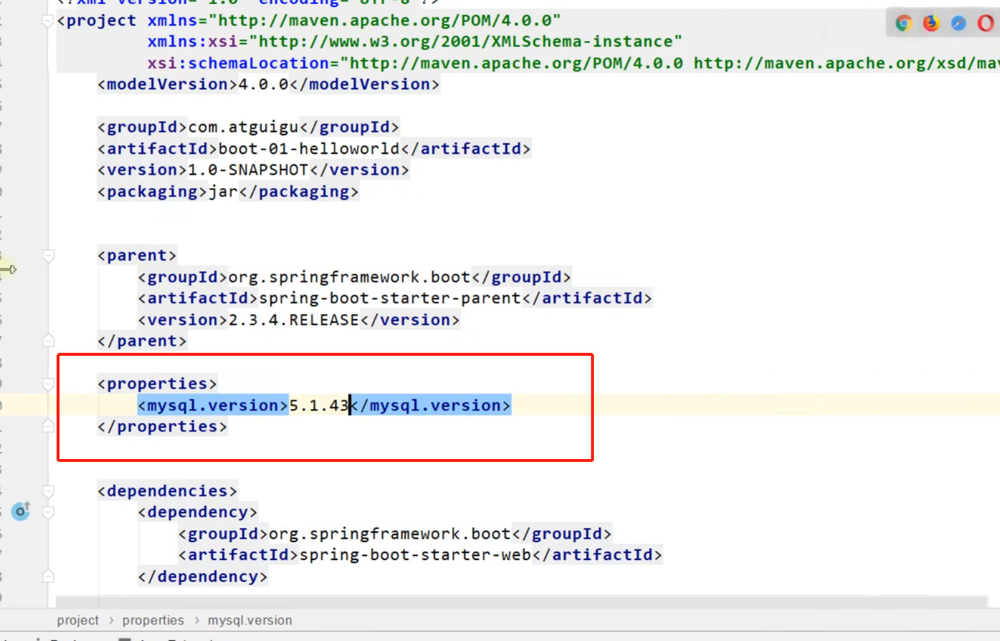

# Spring Boot

----  

# 常用注解

# 1. @Conditional

@Conditional注解是从Spring4.0才有的，可以用在任何类型或者方法上面，通过@Conditional注解可以配置一些条件判断，当所有条件都满足的时候，被@Conditional标注的目标才会被Spring容器处理     
@Conditional的使用很广，比如控制某个Bean是否需要注册，在Spring Boot中的变形很多，比如@ConditionalOnMissingBean、@ConditionalOnBean等等，如下：    
     
像我项目就用到了@ConditionalOnProperty   


----
 
这个注解的源码如下：  
    
只有一个属性value，表示判断的条件(一个或多个)   
注解实现的原理很简单，就是通过org.springframework.context.annotation.Condition这个接口判断是否应该执行操作
 
----

好了既然说到了spring源码中的Condition，那就看看Condition吧    
    
可以看到这是个函数式接口，位于spring-context模块下,其中有一个matches方法，返回true表示条件成立，反之不成立    
var1: 条件上下文，可以用来获取容器的上下文信息    
var2: 用来获取被@Conditional标注的对象上的所有注解信息

深入了解第一个参数的类，ConditionContext:

```java
public interface ConditionContext {

    /**
     * 返回bean定义注册器，可以通过注册器获取bean定义的各种配置信息
     */
    BeanDefinitionRegistry getRegistry();

    /**
     * 返回ConfigurableListableBeanFactory类型的bean工厂，相当于一个ioc容器对象
     */
    @Nullable
    ConfigurableListableBeanFactory getBeanFactory();

    /**
     * 返回当前spring容器的环境配置信息对象
     */
    Environment getEnvironment();

    /**
     * 返回资源加载器
     */
    ResourceLoader getResourceLoader();

    /**
     * 返回类加载器
     */
    @Nullable
    ClassLoader getClassLoader();
}
```

    
----  
如何自定义Condition


----

常用的Confition注解   


比如在WEB模块的自动配置类WebMvcAutoConfiguration下有这样一段代码：

```java
  @Bean
  @ConditionalOnMissingBean
  public InternalResourceViewResolver defaultViewResolver() {
   InternalResourceViewResolver resolver = new InternalResourceViewResolver();
   resolver.setPrefix(this.mvcProperties.getView().getPrefix());
   resolver.setSuffix(this.mvcProperties.getView().getSuffix());
   return resolver;
  }   
```

常见的@Bean和@ConditionalOnMissingBean注解结合使用，意思是当容器中没有InternalResourceViewResolver这种类型的Bean才会注入。这样写有什么好处呢？好处很明显，可以让开发者自定义需要的视图解析器，如果没有自定义，则使用默认的，这就是Spring
Boot为自定义配置提供的便利

----  

# 2.@ConditionalOnProperty

open-capacity-platform项目中用到了@ConditionalOnProperty,深入学习下     


在spring boot中有时候需要控制配置类是否生效,可以使用@ConditionalOnProperty注解来控制@Configuration是否生效

源码：  


@ConditionalOnProperty   
1、name或value是必填项    
2、matchIfMissing：当未找到对应配置是否匹配(默认不匹配)    
3、常用组合：   
(prefix)+name+havingValue 判断是否包含某属性且属性值与havingValue一致    
(prefix)+value 判断是否包含所有value

来看应用场景：

* springboot的自动装配中就大量运用到了这个
* @EnableScheduling,定时任务，开发环境不想让他一直运行   
  类上添加注解，然后配置文件中将是否定时任务的配置改为false，这样就能关闭定时任务     
  @ConditionalOnProperty(name = "task.enable", havingValue = "true")
* 多个配置文件通过这个控制具体读取哪个

总结：  
通过@ConditionalOnProperty控制配置类是否生效,可以将配置与代码进行分离,实现了更好的控制配置    
@ConditionalOnProperty实现是通过havingValue与配置文件中的值对比,返回为true则配置类生效,反之失效

----

# 3. @ConfigurationProperties

@ConfigurationProperties是springboot提供读取配置文件的一个注解。其对应的bean的后置处理器为 ConfigurationPropertiesBindingPostProcessor

在bean被实例化后，会调用后置处理，递归的查找属性，通过反射注入值，对大多数属性而言强制需提供其setter和getter方法

# 4.@AutoConfigurexxx

#### @AutoConfigureAfter

当前配置类在指定配置类之后执行

用在自动配置类上面，表示该自动配置类需要在另外指定的自动配置类配置完之后。

如 Mybatis 的自动配置类，需要在数据源自动配置类之后。

```java
@AutoConfigureAfter(DataSourceAutoConfiguration.class)
public class MybatisAutoConfiguration {
``` 

#### @AutoConfigureOrder

指定优先级，数值越小，优先级越高。


# Springboot操作

### springboot的一些便利地方

因为springboot-starter依赖就包含了很多平常使用的依赖并且指定了版本，如果你要自定义版本号，就参考以下示例(将mysql8.0依赖改成自己想要的)    
步骤： 如果发现和包的版本不一样就手动更改   
    
实例：  


开发的时候主要是引入springboot-starter-*，这样就有一整套依赖了   
    
   


@SpringBootApplication的部分源代码         


    
自动配置是按需加载的，你pom有什么，他才加载什么

# springboot底层注解

### 配置类和Bean的编写方法 --> @Configuration,@Bean

    
也可以不叫方法名，可以用@Bean("名字")来自定义名字  
然后这些实例默认是单实例的，幂等性，这就不用说了   
  
结果如下： 证明是单实例的，具体的原理后面说       


###### 代码

    
配置类

```java
@Configuration  // 告诉Springboot这是一个配置类
public class ServiceConfig {

    @Bean   //给容器中添加组件，以方法名作为id。返回类型为Pet，返回值为方法返回的示例，就是组件在容器中的实例
    public Pet getPet() {
        return new Pet("石煜峰");
    }

    @Bean("tom")
    public Tom getTom() {
        return new Tom("曹程红");
    }

}   


```

启动类

```java
@SpringBootApplication
public class SpringbootApplication {

    public static void main(String[] args) {
        //返回我们的IOC容器
        ConfigurableApplicationContext run = SpringApplication.run(SpringbootApplication.class, args);
        //查看容器里面的组件
        for (String beanDefinitionName : run.getBeanDefinitionNames()) {
            System.out.println(beanDefinitionName);
        }


        //从容器中获取组件
        Tom tom = run.getBean("tom", Tom.class);
        Tom tom2 = run.getBean("tom", Tom.class);
        System.out.println(tom == tom2);
    }

}  
```

###### 结果


注意配置类本身也是容器中的一个组件

##### springboot2。0之后 @Configuration多了一个注解属性proxyBeanMethods，默认是true


```java
@Configuration(proxyBeanMethods = true)    
```

翻译过来是  "代理bean的方法"


我们可以验证一下调用这些注册方法是否都是一个对象      
   
结果是true，证明了结论是正确的      
原因就在于，@Configuration中的proxyBeanMethods默认为true，说明这个方法会被代理

我们把配置类打印出来   
    
结果如下：    
     
被CGLIB增强了，所以我们获取到的是代理对象

这个属性是true，就是代理对象调用方法，springboot会检查这个组件是否在容器中，没有再创建，有的话就用，保持这个组件的单实例

如果是false的话那就不是单实例对象了，每次调用注册方法都会返回一个新的对象

用法是组件依赖，为true的时候下面示例就是正确的      


springboot2.0的一个突破就是分为了全模式和轻量级模式， 全模式就是需要代理，proxyBeanMethods=true，这样可以完成组件依赖，但是每次启动都会检查是否满足依赖，启动较慢   
轻量级模式是proxyBeanMethods=false，这样就不用检查了，启动很快，所以如果我们平常不需要用到组件依赖的话，我们都是设置为@configuration(proxyBeanMethods = false)

### @Import

可以用在配置类或者任意一个组件上     
注解源码   


使用示例和作用    
    
可以写自己本地代码写的，也可以写maven其他包下的类，springboot会自动调用他们的无参构造器

代码示例:
我在配置类导入了Pet这个类

```java
@Import({Pet.class, AnnotationBeanNameGenerator.class})
@Configuration(proxyBeanMethods = false)  // 告诉Springboot这是一个配置类
public class ServiceConfig {
```

```java
@SpringBootApplication
public class SpringbootApplication {

    public static void main(String[] args) {
        //返回我们的IOC容器
        ConfigurableApplicationContext run = SpringApplication.run(SpringbootApplication.class, args);
        String[] beanNamesForType = run.getBeanNamesForType(Pet.class);
        for (String str : beanNamesForType) {
            System.out.println(str);
        }

        AnnotationBeanNameGenerator bean = run.getBean(AnnotationBeanNameGenerator.class);
        System.out.println(bean);
    }
}
```

运行结果如下：   
   
Pet有两条打印的原因是一个是我Import导进去的Pet对象默认名字为类的全路径名，然后第二个是我配置类@Bean创建的，名字为构造的方法名

### @Conditional

条件装配：满足Conditional指定的条件，则进行组件进入

   
大部分都见名知意   
ConditionalOnSingleCandidate,需要组件只有一个实例或者他有多个实例但是有一个实例是主实例，就是用@Primary标注的实例 ConditionalOnProperty当配置文件中配置了哪一个属性才生效

##### @ImportResource:当有人还在用xml配置文件的时候，你可以直接用这个导入到配置类，就可以不用一个个写@bean


### @ConfigurationProperties:用来读取配置文件


  
    


如果我们引用的是其他包下的，那个类没有@Component    
   
那我们就用第二种方法：@EnableConfigurationProperties

这种方法只能在配置类上写  


# 自动配置，源码分析


    
@Configuration和@ComponentScan就不用说了，一个配置类，一个扫描包 主要来讲@EnableAutoConfiguration

##### @EnableAutoConfiguration

源码如下：

```java
@Target({ElementType.TYPE})
@Retention(RetentionPolicy.RUNTIME)
@Documented
@Inherited
@AutoConfigurationPackage
@Import({AutoConfigurationImportSelector.class})
public @interface EnableAutoConfiguration {
    String ENABLED_OVERRIDE_PROPERTY = "spring.boot.enableautoconfiguration";

    Class<?>[] exclude() default {};

    String[] excludeName() default {};
}   
```

1. @EnableAutoConfiguration里面第一个陌生的是@AutoConfigurationPackage，机翻就是自动配置包，指定了默认的包规则，批量注册Register

自动配置包源码如下：

```java
@Target({ElementType.TYPE})
@Retention(RetentionPolicy.RUNTIME)
@Documented
@Inherited
@Import({Registrar.class})      //给容器中导入一个组件   
public @interface AutoConfigurationPackage {
    String[] basePackages() default {};

    Class<?>[] basePackageClasses() default {};
}
```

可以看到@Import导入了Registrar给容器导入了一系列组件  
点进Registrar的源码

```java
        public void registerBeanDefinitions(AnnotationMetadata metadata, BeanDefinitionRegistry registry) {
            AutoConfigurationPackages.register(registry, (String[])(new AutoConfigurationPackages.PackageImports(metadata)).getPackageNames().toArray(new String[0]));
        }
```

AutoConfigurationPackages.PackageImports(metadata)).getPackageNames()获得的包名是主类所在的包    
也就是springboot启动类SpringbootApplication所在的那个包，然后注册这个包下的所有组件

2. @EnableAutoConfiguration第二个要点是@Import({AutoConfigurationImportSelector.class})，给容器批量导入一些组件       
       
      
       
       
   那些开头要加载的类有127个写死在META-INF下的spring.factories文件中，当然了有很多都不会加载，其实表面来看是取决于你的pom导入了什么包，因为你即使配置文件中写了这个类但是不满足这个类上面的若干个@ConditionalOnXXX一大堆东西

会按需开启自动配置项
   
这些自动配置项，是通过各种各样的@ConfitionalOnXXX注解去控制要自动配置什么       
       


    
不直接返回MultipartResolver，而是写参数，让参数对象自己去容器中找到这个组件然后再返回该对象，这样子定义了命名规范   
不管用户配置的是啥，都能返回我们要求的名字

像springboot有关中文的输入输出啊都不会乱码，是因为底层已经帮我们配好了

    
然后看这个字符过滤器，@ConditionalOnMissingBean，如果用户没配那我系统就帮你配

通过上述的例子我们可以发现springboot的设计模式


# 自动装配的流程


所以要改啥就在application.properties或者 .yaml文件中改就行了，可以查文档也可以直接去底层源码看要改什么属性

# 自动装配原理

SpringBoot 启动的时候，会调用 run 方法，run 方法会刷新容器，刷新容器的时候他会通过 @EnableAutoConfiguration 注解找到META-INF/spring.factories
文件中的所有自动配置类，我们会在启动的时候把这些配置类加载到容器里面，这些配置类里面有好多的条件注解，他会根据我们有没有引入相应的 jar 包，有没有注入一些 bean 来自动的给我们的容器注入我们需要的 bean ，于是就实现了自动装配

# 开发提示

我们要在配置文件中写属性什么的，如果不是官方的不会有提示，我们可以自己开启   


可以加入这个依赖   
     
然后就有提示了     


最后是项目打包的时候，不要把这个提示器打包了，jvm会额外消耗       


# Web开发

# 自定义starter

<https://www.bilibili.com/video/BV19K4y1L7MT?p=83&vd_source=13963cd0b42527aeff4eae71d903e659>


# springboot启动过程

1. springboot启动过程
   

源码中   
getSpringFactoriesInstances()  这个方法的作用就是去spring.factories文件中相关类
要注意，spring.factories是所有pom依赖里面的spring.factories，各个包下的，很多都有这个文件，当然了最底层的这个文件是在名为spring-boot-版本号的jar包下

# 一些报错信息的总结

        