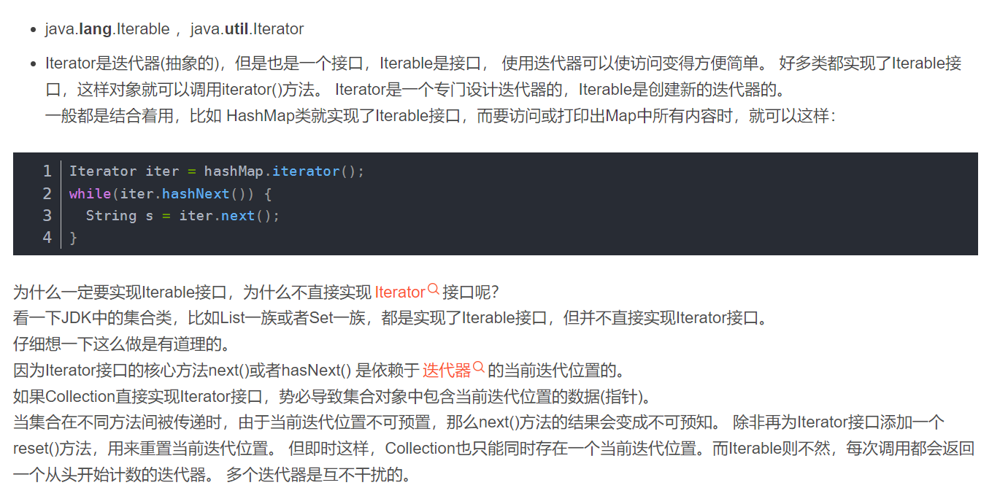
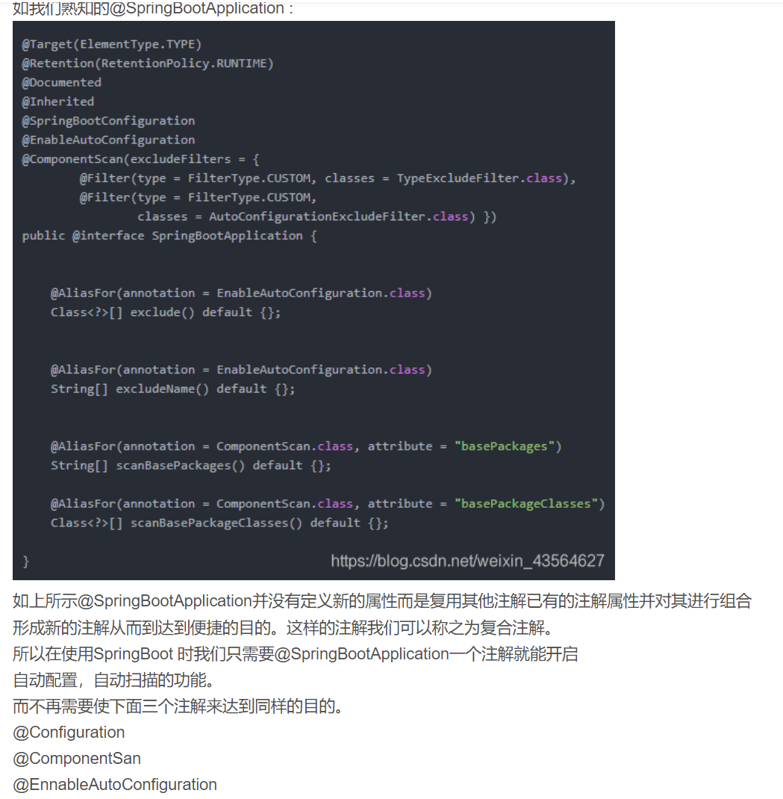

#### iterator 和 iterable 的区别

#### StringBuilder StringBuffer

StringBuffer是线程安全的 StringBuilder是单线程的，不提供同步，理论上效率更高

#### 注解

###### @Target(ElementType.TYPE) //当前注解的使用范围

###### @Retention(RetentionPolicy.RUNTIME) //生命周期

###### @Documented //声明在生成 doc 文档时是否带着注解

###### @Inherited //声明是否子类会显示父类的注解

###### @AliasFor

@AliasFor是一个注解,用于为注解属性声明别名。

    