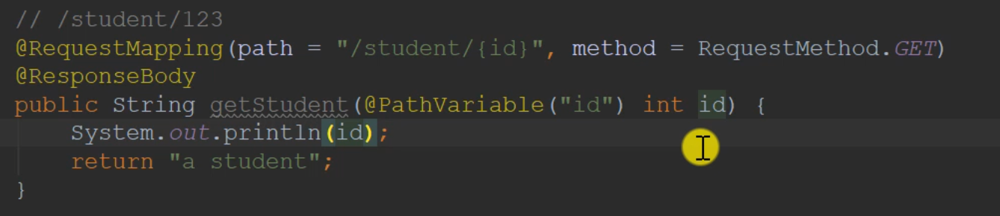

  

    
 
来看看流程    
   


* 浏览器访问服务器，然后由前端控制器Front controller处理请求，也就是DispatcherServlet      
* 然后DispatcherServlet通过路径去调用Controller，Controller会把数据封装到model里返回给前端控制器   
* DispatcherServlet得到这些数据以后就会去调用view template视图模板，这个模板是一个文档，里面会有一些特殊符号，用model中动态的值替换，然后生成动态的网页
* 把html返回给前端控制器，接着返回到浏览器    

实际开发的时候不用对前端控制器做什么处理，是自动去运行的   

# Thymeleaf   

    

<www.thymeleaf.org/documentation.html>     

    


###  通过request对象获取相关数据的办法
     
 
GET请求  （请求数据）
       
    

POST请求（提交数据）  

只要是你路径正确，然后参数和表单中的name相同，那就可以自动获取到   
表单代码：   
    
java代码如下：   
   


# 如何向浏览器发送响应动态的html数据   用ModelAndView  
例子：客户端要查询一个老师的信息，然后服务端返回老师的信息，响应给浏览器   

这个ModelAndView就是要返回给DispatcherServlet的model和view两份数据  

原理： DispatcherServlet调用controller层的方法，然后方法返回model和view，然后提交给模板引擎比如Thymeleaf,然后由模板引擎渲染，生成动态的html      

```java
public ModelAndView getTeadcher() {
    ModelAndView mav = new ModelAndView();
    //    
    mav.addObject("name","张三");
    mav.addObject("age",30);
    //设置模板的路径和名字, /templates不用写，默认的,然后是文件的后缀不用写，有后置的     
        
    mav.setViewName("/demo/html");    
    return mav;
}
```

    

注意了，html需要声明，告诉编译器，这不是普通的html文件    
<html xmlns:th="http://www.thymeleaf.org">    

第二种方法：  简便方法   
下面这种方法简化了第一种方法，上面的方法比较直观； DispatcherServlet有model的引用的，看到我们的方法有Model类型的参数，会自动给它传进去  
```java
public String getTeadcher(Model model) {
ModelAndView mav = new ModelAndView();
//    
mav.addAttribute("name","张三");
mav.addAttribute("age",30);
//设置模板的路径和名字, /templates不用写，默认的,然后是文件的后缀不用写，有后置的

        //这里返回的String类型的数据是路径  
    return "/demo/html"
}
```


### 响应json数据 

使用环境： 异步请求   
简单来说，异步请求那就是，我们注册的时候，给我们的提示，但是我们的网页是并未刷新的，悄悄的访问了服务器一次          
    


   

DispatcherServlet拿到这个方法的时候，看到你加了@ResponseBody注解，加上你的返回类型是Map<String,Object>，他会自动给他转换成json字符串发送给浏览器   


单个json的格式：   {"key":"value","key","value"}
  
不同的key用,隔开  

### 查询所有的员工   
List集合装多个结果        
   


集合类型的json格式  [{"key":"value","key","value"},{"key":"value","key","value"}]
    