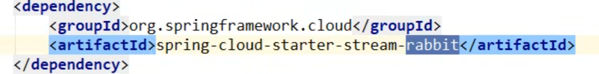
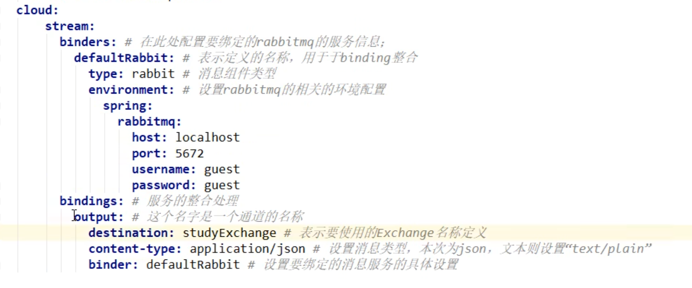
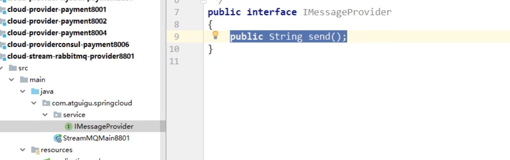
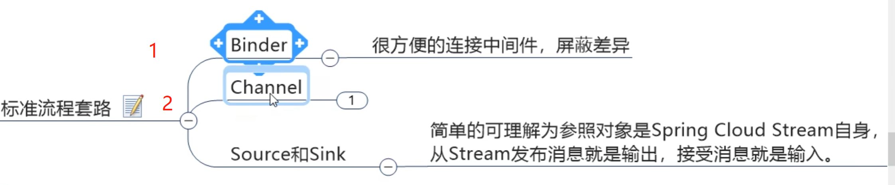
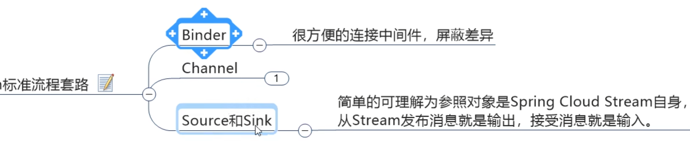
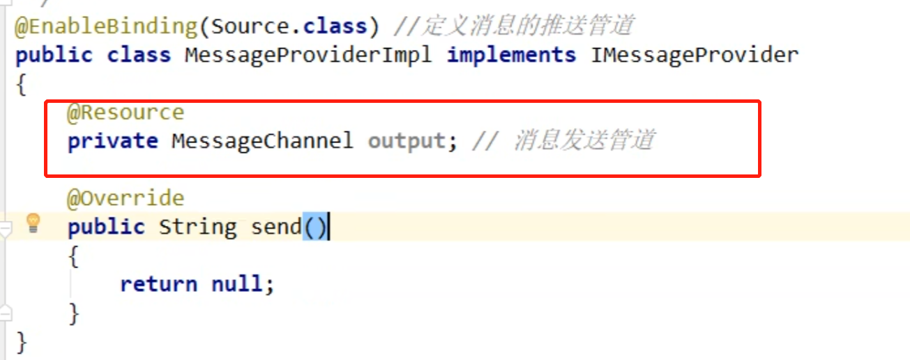
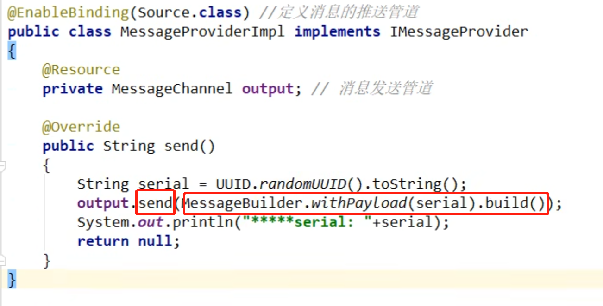

# GateWay   
### 简介   
     

底层引入了Netty
      


### 能做什么？   

挡在前面   
    

负载均衡是nginx    
然后下面是网关     
    


反向代理
鉴权
流量控制
熔断 
日志监控   


### Gateway是非阻塞io，Zuul是阻塞的  

    

       

    


      


### 三大核心概念    ：Route路由，Predicate断言，Filter过滤    和RabbitMq很像   
    
   


###### GateWay流程   
   


* 客户端向 Spring Cloud Gateway 发出请求。然后在 Gateway Handler Mapping 中找到与请求相匹配的路由，将其发送到 Gateway Web Handler。
* Handler 再通过指定的过滤器链来将请求发送到我们实际的服务执行业务逻辑，然后返回。  
  过滤器之间用虚线分开是因为过滤器可能会在发送代理请求之前（“pre”）或之后（“post”）执行业务逻辑。
* Filter在“pre”类型的过滤器可以做参数校验、权限校验、流量监控、日志输出、协议转换等，  
  在“post”类型的过滤器中可以做响应内容、响应头的修改，日志的输出，流量监控等有着非常重要的作用。   


核心逻辑就是  路由转发和执行过滤链   


# 使用GateWay


##### 网关类的application.yml配置文件
``` yaml
server:
  port: 9527

spring:
  application:
    name: cloud-gateway

  cloud:
    gateway:
      routes:
        - id: payment_routh #payment_route    #路由的ID，没有固定规则但要求唯一，建议配合服务名
          uri: http://localhost:8001          #匹配后提供服务的路由地址
          predicates:
            - Path=/payment/get/**         # 断言，路径相匹配的进行路由

        - id: payment_routh2 #payment_route    #路由的ID，没有固定规则但要求唯一，建议配合服务名
          uri: http://localhost:8001          #匹配后提供服务的路由地址
          predicates:
            - Path=/payment/lb/**         # 断言，路径相匹配的进行路由

eureka:
  instance:
    hostname: cloud-gateway-service
  client: #服务提供者provider注册进eureka服务列表内
    service-url:
      register-with-eureka: true
      fetch-registry: true
      defaultZone: http://localhost:7001/eureka
```

参数说明:
```yaml
  cloud:
    gateway:     #网关
      routes:    #路由
        - id: XXX #payment_route    #路由的ID，没有固定规则但要求唯一，建议配合服务名
          uri: http://localhost:XXXX          #匹配后提供服务的路由地址
          predicates:
            - Path=/XXX/XXX        # 断言，路径相匹配的进行路由
```
配置了uri后，当用户访问http://localhost:XXXX后，9527端口的网关会挡在他前面
没配置网关以前   
  
配置网关以后,能通过9527访问8001    
  


##### 动态路由
```yaml
server:
  port: 9527

spring:
  application:
    name: cloud-gateway

  cloud:
    gateway:
      discovery:
        locator:
          enabled: true #开启从注册中心动态创建路由的功能，利用微服务名进行路由
      routes:
        - id: payment_routh #payment_route    #路由的ID，没有固定规则但要求唯一，建议配合服务名
          uri: lb://cloud-payment-service         #匹配后提供服务的路由地址
          predicates:
            - Path=/payment/get/**         # 断言，路径相匹配的进行路由

        - id: payment_routh2 #payment_route    #路由的ID，没有固定规则但要求唯一，建议配合服务名
          uri: lb://cloud-payment-service          #匹配后提供服务的路由地址
          predicates:
            - Path=/payment/lb/**         # 断言，路径相匹配的进行路由

eureka:
  instance:
    hostname: cloud-gateway-service
  client: #服务提供者provider注册进eureka服务列表内
    service-url:
      register-with-eureka: true
      fetch-registry: true
      defaultZone: http://localhost:7001/eureka
```
加了两个地方的配置,lb:负载均衡 load balancing
```yaml
      discovery:
        locator:
          enabled: true #开启从注册中心动态创建路由的功能，利用微服务名进行路由


      uri: lb://cloud-payment-service #匹配后提供服务的路由地址
```  
  
  
实现了网关层面服务的负载均衡

##### Predicate
说白了，Predicate就是为了实现一组匹配规则，  
让请求过来找到对应的Route进行处理。

```yaml
predicates:
      - Path=/payment/lb/**         # 断言，路径相匹配的进行路由
      - After=2020-02-05T15:10:03.685+08:00[Asia/Shanghai]         # 在这个事件后
      - Before=2020-02-05T15:10:03.685+08:00[Asia/Shanghai]         # 在这个事件前
      - Between=2020-02-02T17:45:06.206+08:00[Asia/Shanghai],2020-03-25T18:59:06.206+08:00[Asia/Shanghai]
      - Cookie=username,zzyy   #Cookie Route Predicate需要两个参数，一个是 Cookie name ,一个是正则表达式。路由规则会通过获取对应的 Cookie name 值和正则表达式去匹配，如果匹配上就会执行路由，如果没有匹配上则不执行
      - Header=X-Request-Id, \d+  # 请求头要有X-Request-Id属性并且值为整数的正则表达式
      - Host=**.atguigu.com    #Host Route Predicate 接收一组参数，一组匹配的域名列表，这个模板是一个 ant 分隔的模板，用.号作为分隔符。它通过参数中的主机地址作为匹配规则。
      - Method=GET
      - Query=username, \d+  # 要有参数名username并且值还要是整数才能路由
```


##### Filter
路由过滤器可用于修改进入的HTTP请求和返回的HTTP响应，路由过滤器只能指定路由进行使用。  
Spring Cloud Gateway 内置了多种路由过滤器，他们都由GatewayFilter的工厂类来产生

###### 自定义过滤器
1. 实现两个接口
   ```implements GlobalFilter,Ordered```
2. 案例
```java
@Component
public class MyGatewayFilter implements GlobalFilter, Ordered {
    @Override
    public Mono<Void> filter(ServerWebExchange exchange, GatewayFilterChain chain)
    {
        System.out.println("time:"+new Date()+"\t 执行了自定义的全局过滤器: "+"MyLogGateWayFilter"+"hello");

        String uname = exchange.getRequest().getQueryParams().getFirst("uname");
        if (uname == null) {
            System.out.println("****用户名为null，无法登录");
            exchange.getResponse().setStatusCode(HttpStatus.NOT_ACCEPTABLE);
            return exchange.getResponse().setComplete();
        }
        return chain.filter(exchange);
    }
    //filter优先级
    @Override
    public int getOrder()
    {
        return 0;
    }

}
```  
有uname参数就访问   
  
没有uname参数就访问不了  
     