# GateWay   
### 简介   
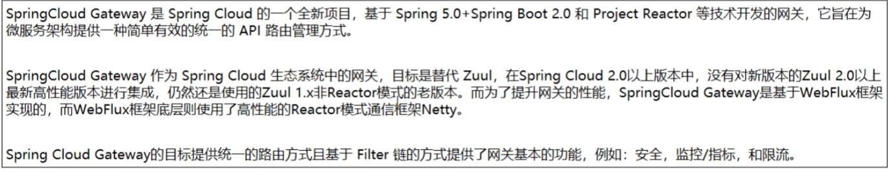     

底层引入了Netty
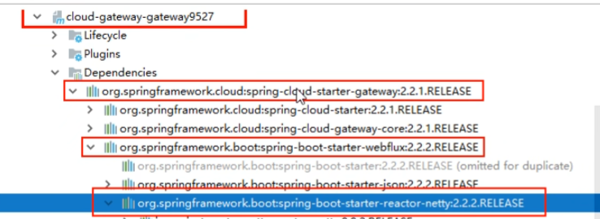      

### 能做什么？   

挡在前面   
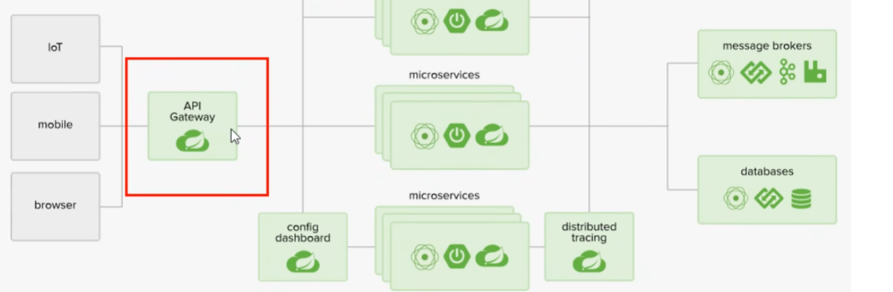    

负载均衡是nginx    
然后下面是网关     
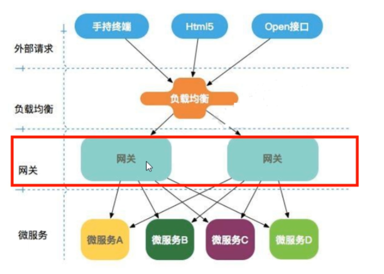    

反向代理
鉴权
流量控制
熔断 
日志监控   

### Gateway是非阻塞io，Zuul是阻塞的  

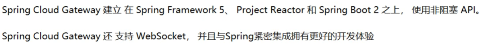    

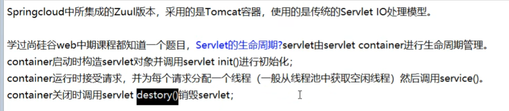       

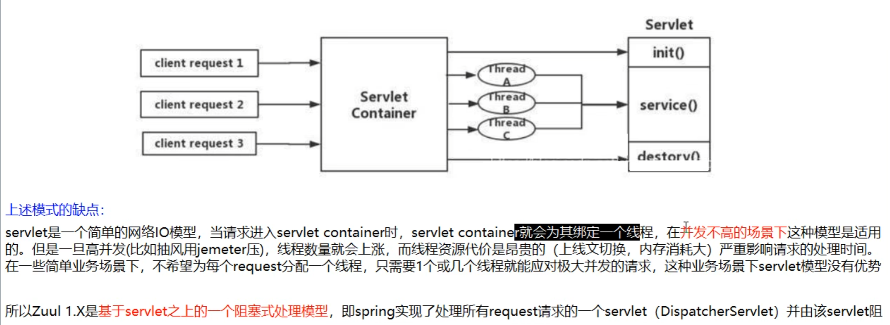    

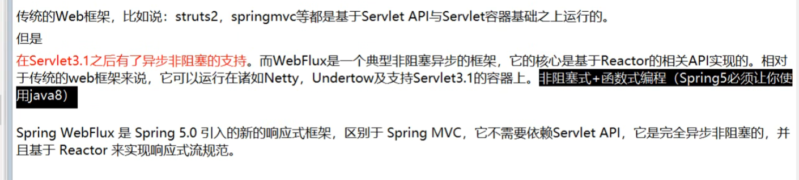      

### 三大核心概念    ：Route路由，Predicate断言，Filter过滤    和RabbitMq很像   
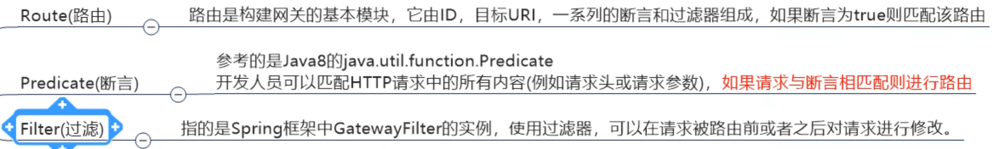   
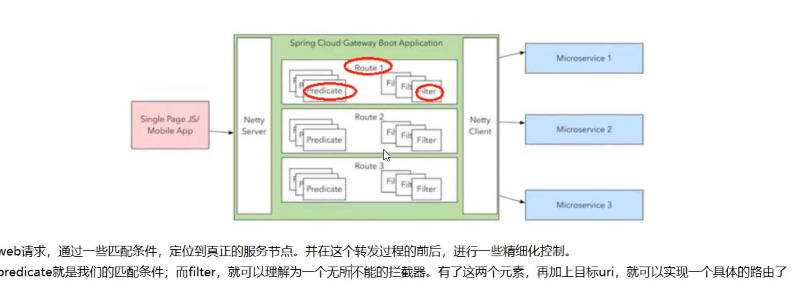   

###### GateWay流程   
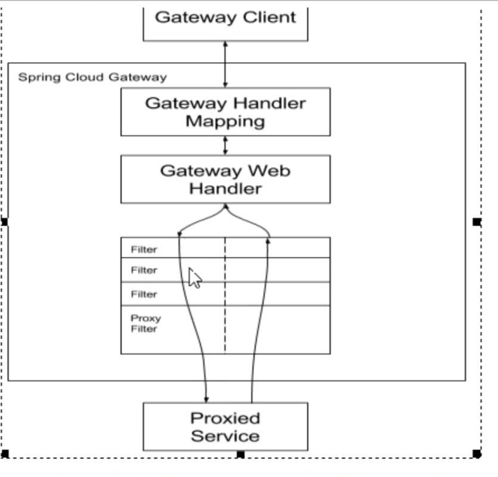   
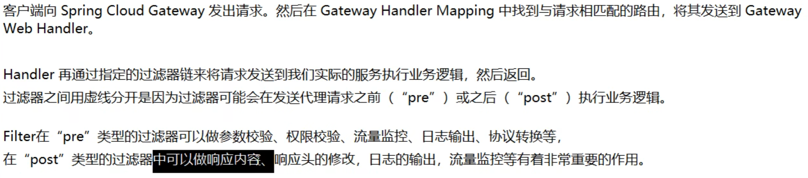    

核心逻辑就是  路由转发和执行过滤链   

