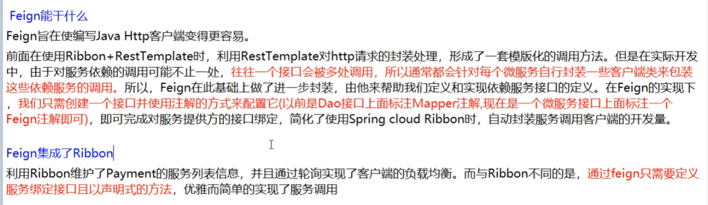
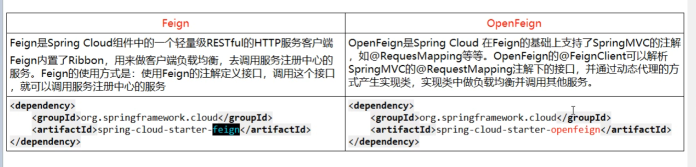
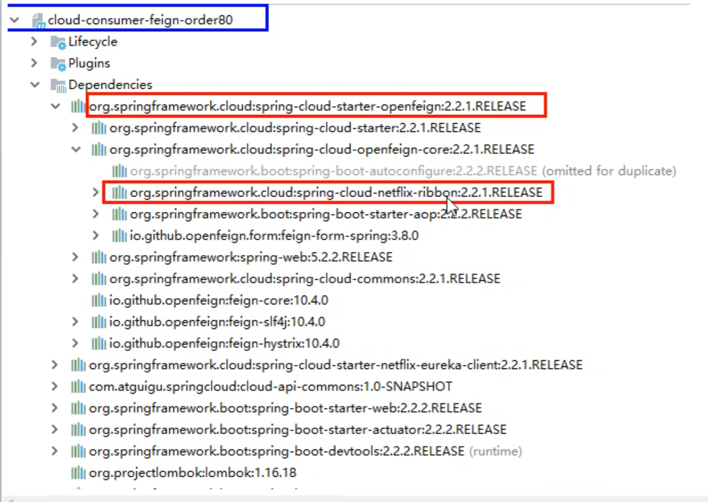
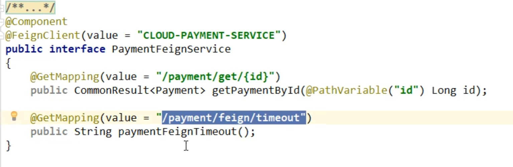
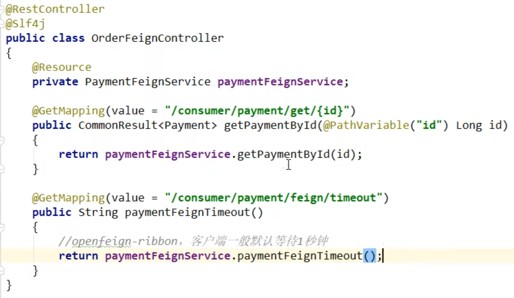
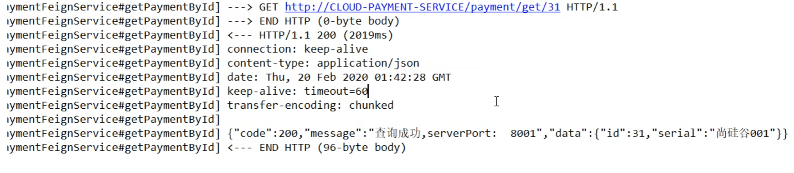
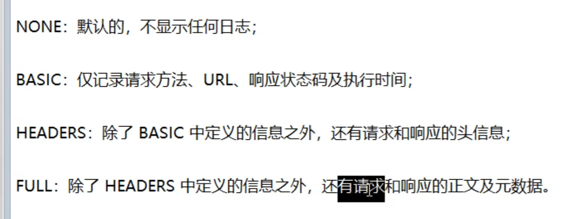
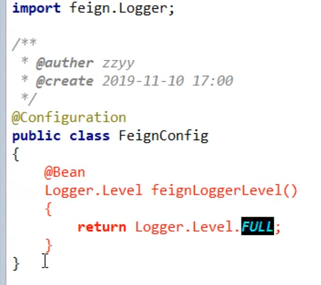
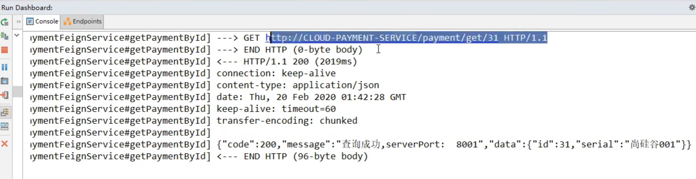

# feign openFeign ： 服务接口调用

### 能干嘛





### 用open Feign代替Ribbon加RestTemplate的做法

Feign自己集成了ribbon，自带负载均衡  


Feign的超时控制就是由ribbon控制的

# 使用步骤

微服务调用接口加@FeignClient

主启动加@EnableFeignClients

业务类   


value里面写微服务名称   
然后类里面写要调用的微服务方法

执行的时候就会找到这个微服务然后执行微服务里面的这个方法



一般就是openfeign微服务controller调用Service（这里是接口），Service接口远程调用其他微服务的Service业务类（这里是类）

# 超时控制

我们服务提供方和消费者要求的程序运行时间可能是不一样的，我们的业务运行要3秒，但是消费者(调用OpenFeign)那边说2秒就受不了了，那我们就需要超时控制了

OpenFeign默认等待1秒钟,超时后报错

yml文件中配置

```yml
#设置feign客户端超时时间 
ribbon:
  #指的是建立连接所用时间   
  ReadTimeOut: 5000   
  #建立连接后从服务器读取可用资源的时间   
  ConnnectTimeOut: 5000

```

# 日志增强


是什么    


日志级别   


配置日志bean



yml文件

```yml
logging:
  level: 
    #feign日志以什么级别监控哪个接口   
    接口的路径: debug      #debug形式  
```

   