# ribbon知识入门  
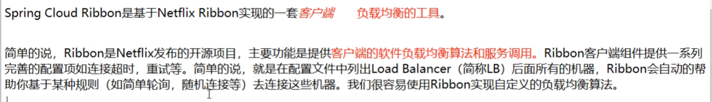   

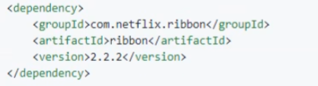   

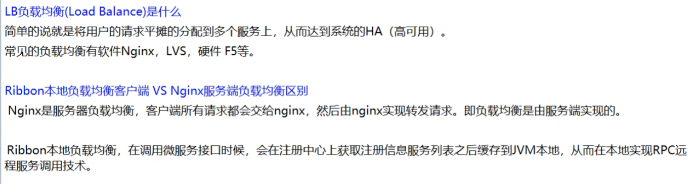    

nginx是服务端的负载均衡，挡在ribbon前面，ribbon是本地客户端的负载均衡    

先过了nginx大门，再选择进ribbon哪个房间    

nginx是集中式负载均衡   
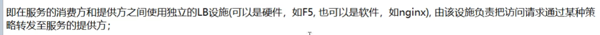     
ribbon是进程内负载均衡（LB:Load Balance）
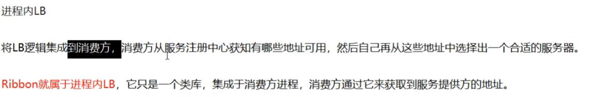     

用Ribbon就是负载均衡加RestTemplate    

### RestTemplate的使用       
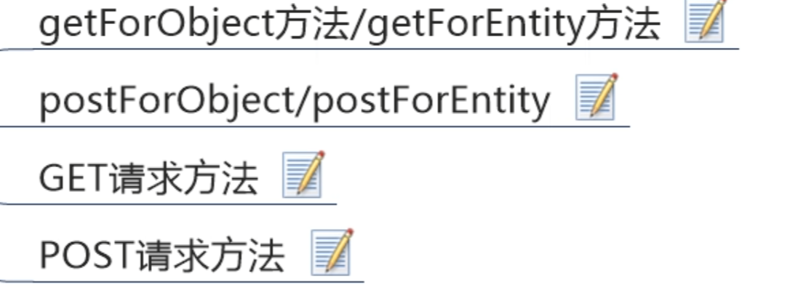     

###### getForObject 和 getForEntity的区别    
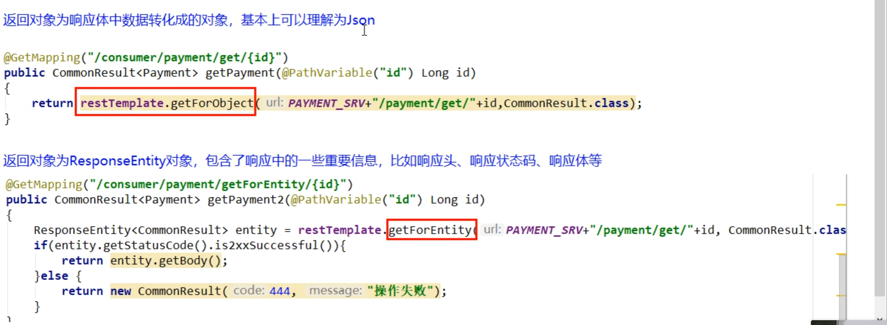      

# 下面是面试官常问的哈，负载均衡算法的实现，和除了轮询以外的负载均衡算法    

## 核心组件：IRule 
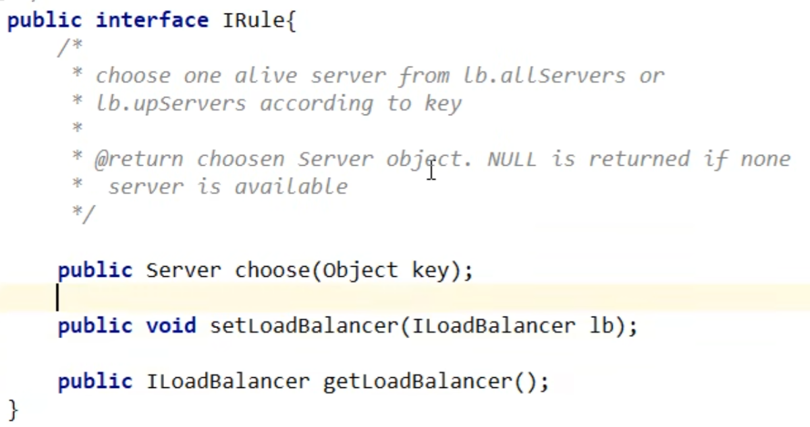   

用IDEA工具打出类图   
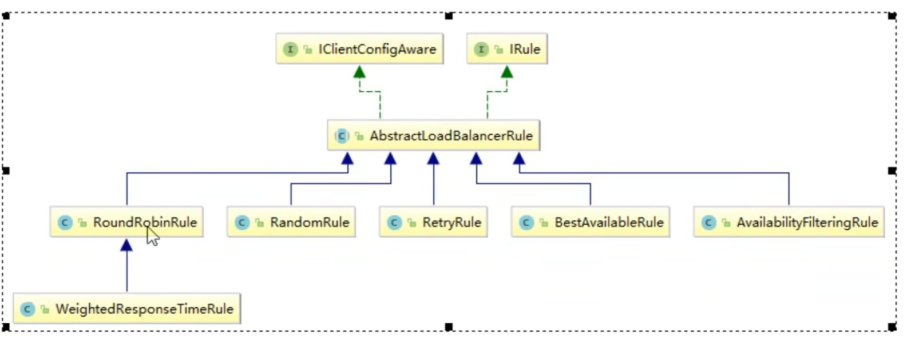      
可以看到有轮询，随机，重试   等   ，具体看下图    
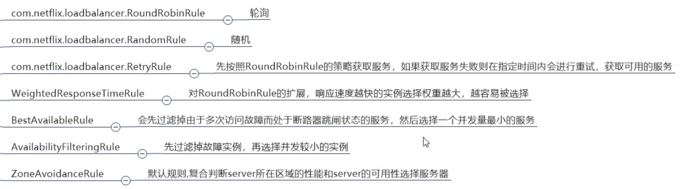    

#### 如何替换，默认是轮询   
要自定义配置的话，要记得了，不仅是Ribbon这里，springboot那边自定义配置类也是不要放在和主启动类一个目录下的，可能会出问题    
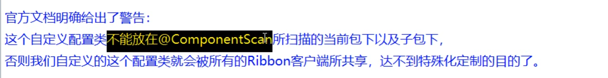    

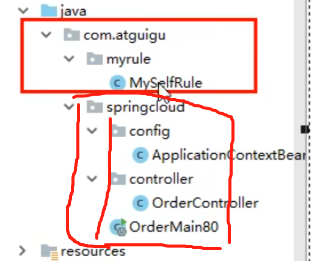   
要新建一个包在外面   

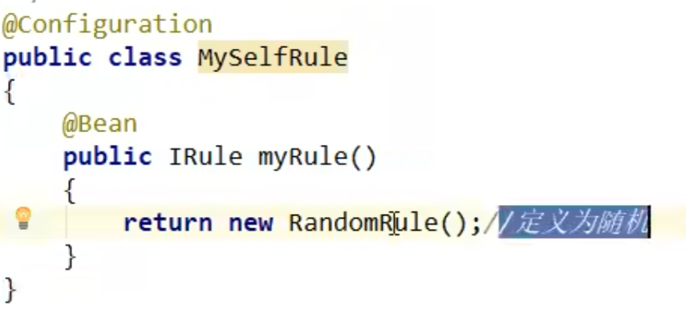     

然后在主启动类上面添加注解@RibbonClient 
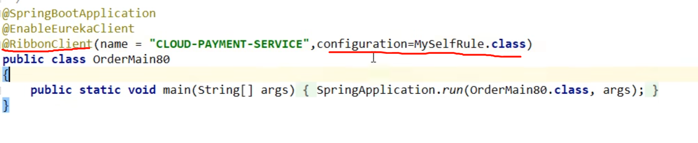   

# 默认策略是轮询，来看看轮询算法原理   
rest接口第几次请求 % 服务器集群机器数       
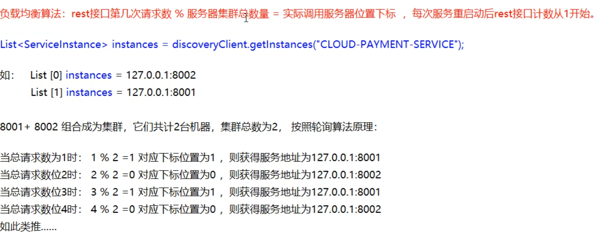     

# RoundRibbonRule源码   
涉及到自旋锁，CAS，和之前的轮询算法原理    

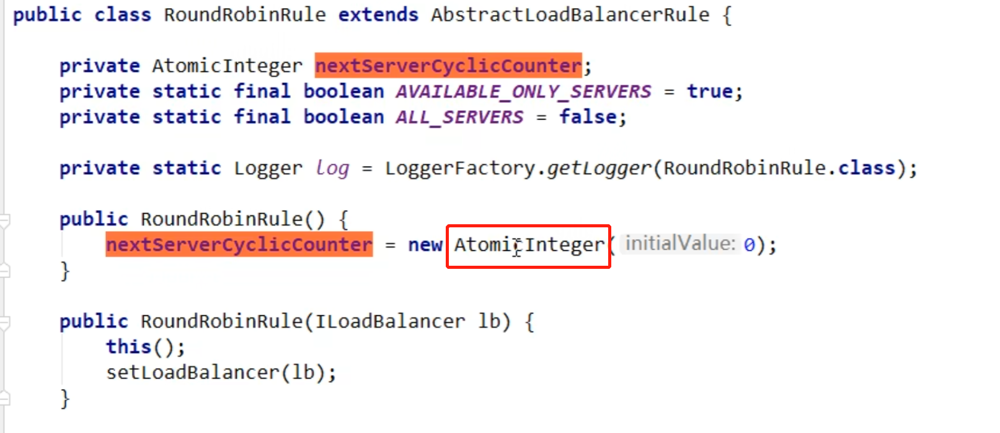   
注意这里的原子类，涉及到并发的知识了           
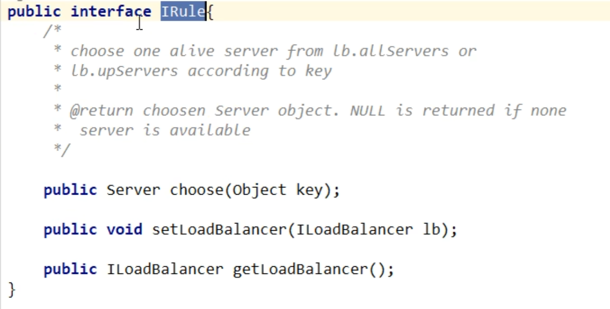      

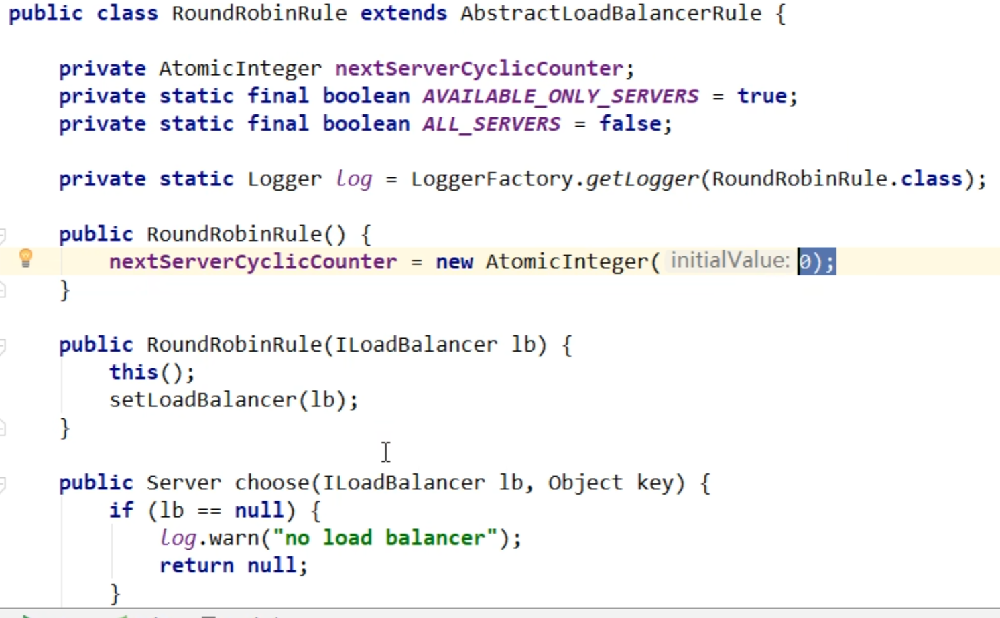    

会判断ILoadBalancer（负载均衡策略）是否存在   

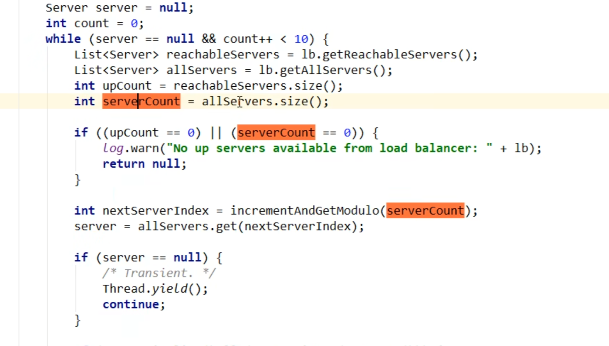    

upCount就是有效服务（活着的机器）的数量     
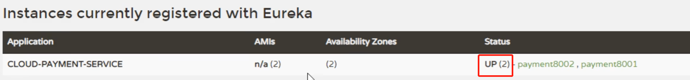   
这个serverCount就是所谓的服务集群总数量   

然后把serverCount传给incrementAndGetModulo();  进行取模运算   

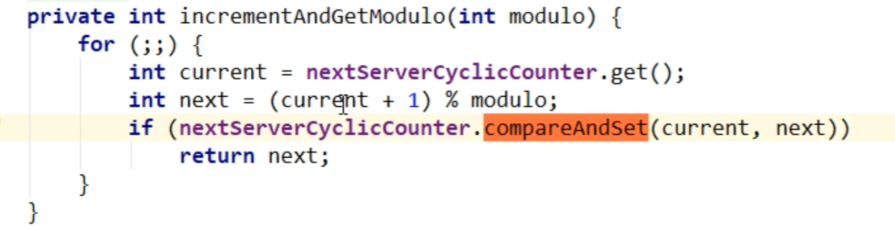     

for自旋锁CAS比较并交换更新取模后的值   
代码很优雅，做到了尽量不用锁    

### Nacos使用Ribbon
<https://blog.csdn.net/zouliping123456/article/details/121682276?spm=1001.2101.3001.6661.1&utm_medium=distribute.pc_relevant_t0.none-task-blog-2%7Edefault%7ECTRLIST%7ERate-1-121682276-blog-124110808.nonecase&depth_1-utm_source=distribute.pc_relevant_t0.none-task-blog-2%7Edefault%7ECTRLIST%7ERate-1-121682276-blog-124110808.nonecase&utm_relevant_index=1>  

