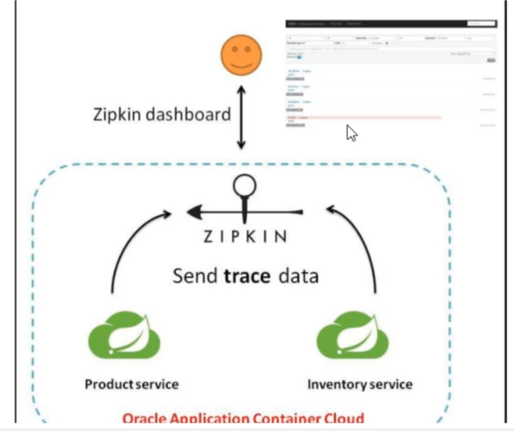
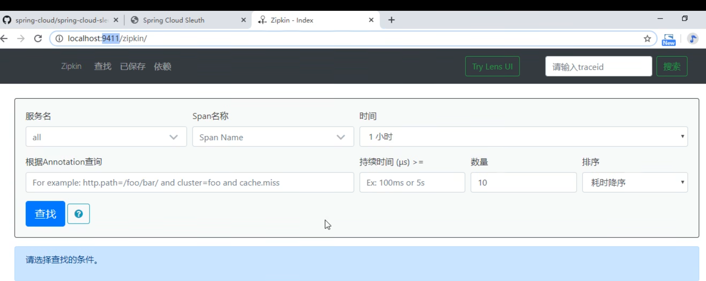
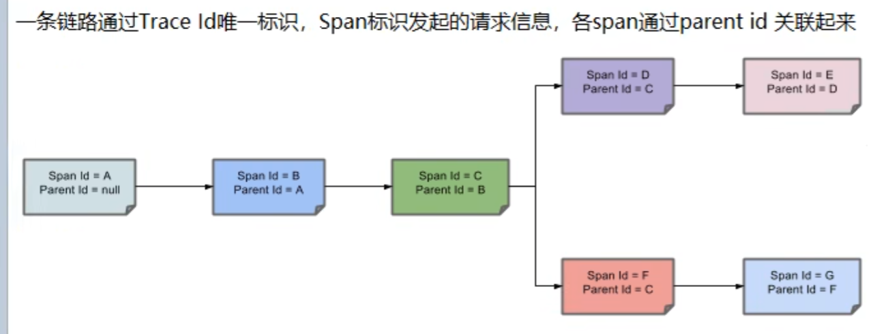
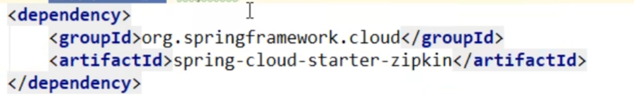
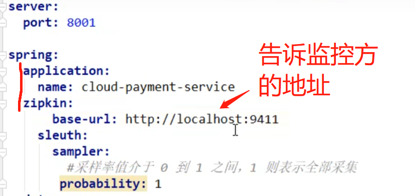
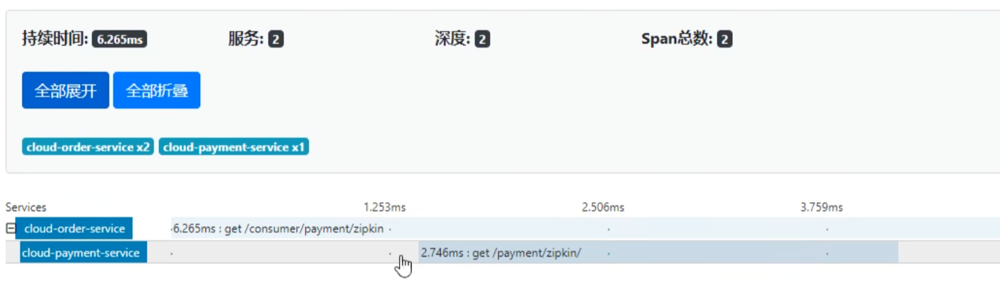
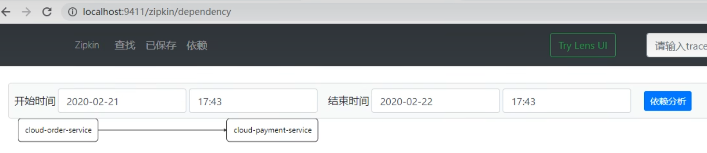

 #Sleuth：分布式请求链路跟踪   
 这个东西是和zipkin搭配使用    

其实就是zipkin，SpringCloud拿来用了然后叫Sleuth

这个技术就是用来监控这个服务走过了多少个微服务模块，这样出问题也能找到  
常用来弄日志系统模块             

     

    

Sleuth监控，zipkin展示控制台     

zipkin 9411端口访问    
下载jar包就行，然后java -jar   ******.jar    
    

链路图   

       
 

搭建   
引入依赖   
    

改yaml文件 
      

用order调用payment
      
    