### 什么是stream

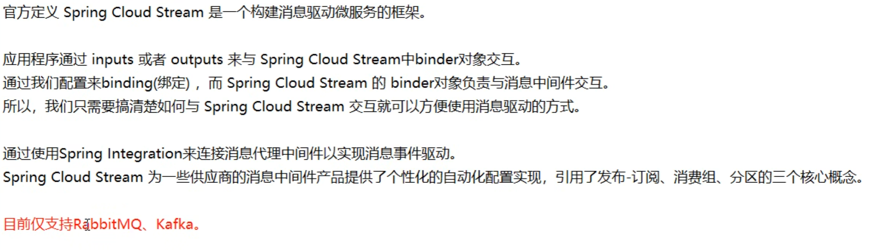    
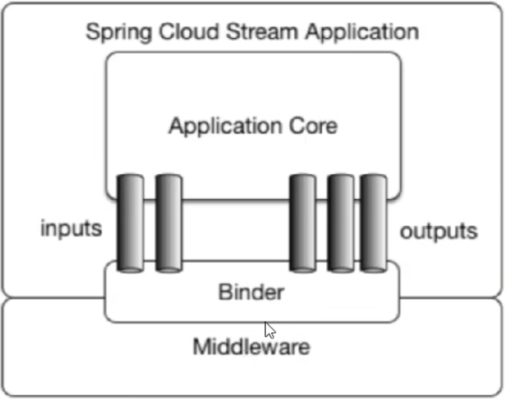    
inputs就是消费者，outputs就是生产者

### 编码常用注解

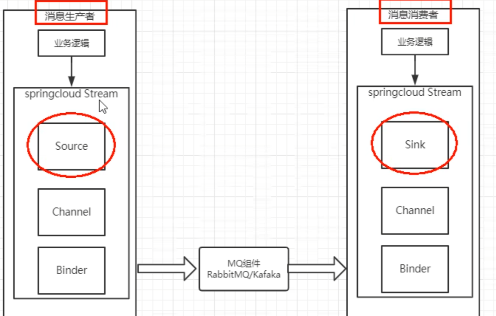

Binder:绑定器，方便连接中间件，屏蔽差异，rabbitmq中的交换机      
channel: 类似中间件中的队列,通过channel对队列进行配置      
Source和Sink  

然后是要用到的注解   

# 实战

pom文件  
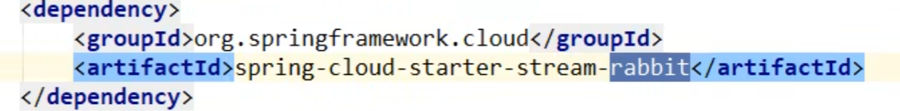   
如果要切换成kafka只要pom文件最后rabbit改成kafka就行了

yml文件   
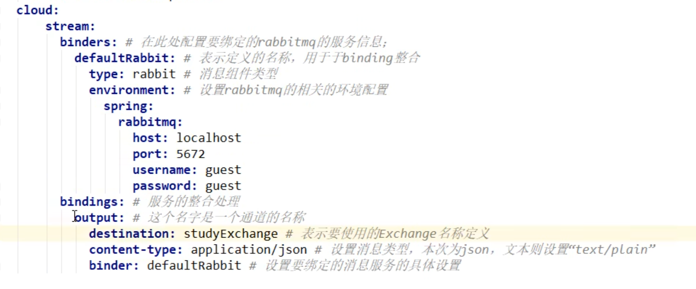

## 生产者模块

#### 业务

##### 发送消息接口

##### 发送消息接口实现类

开发套路：   

流程1： Source      
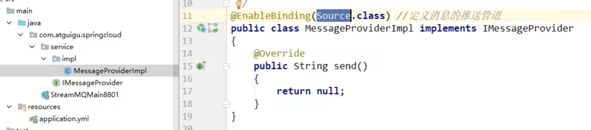       
加上注解，知道理论知识然后进行实操   
生产者这边得有Source，然后要用信道 和 绑定器连接消息中间件

于是我们就用到了@EnableBinding将channel和Exchange绑定在一起

这个@EnableBinding就是框架图中的Outputs

流程2：配置信道 channel  
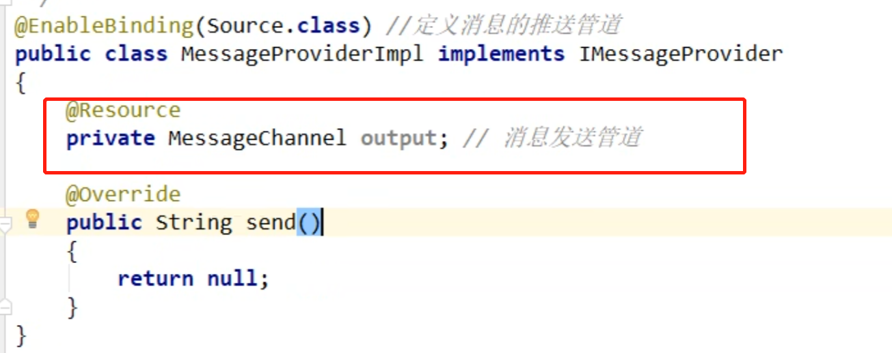

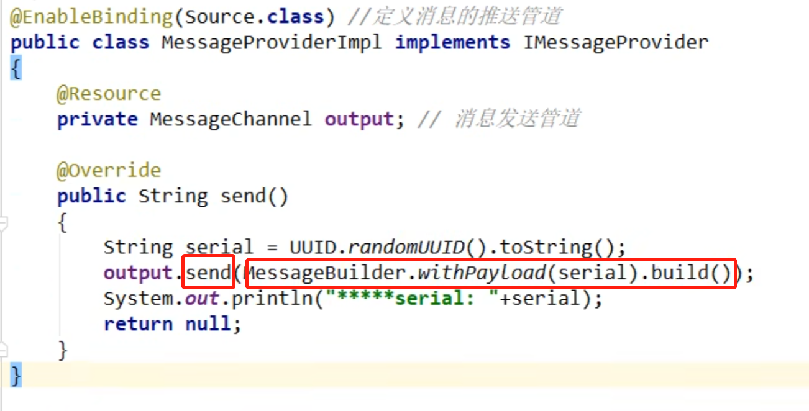

##### Controller

就调用下之前写的类的方法就好了   
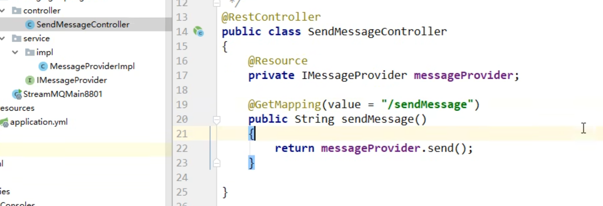

## 消费者模块

yml文件要把output改为input   
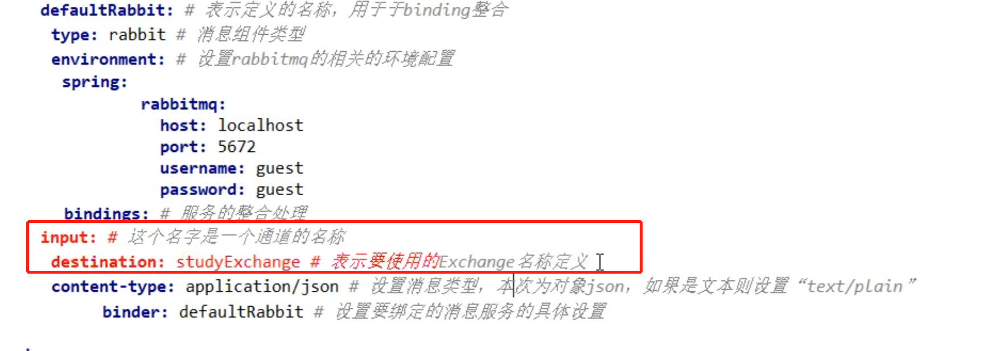

#### 业务

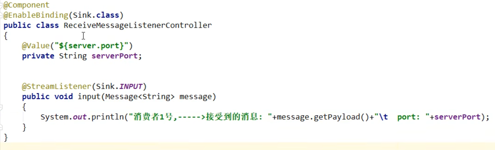

发送消息的时候，是String类型的message，消费的时候，也要是String，所以Message<String>

# 分组和持久化

这个分组直接在yml文件中改就行了，注意对齐问题      
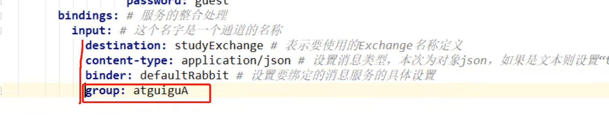

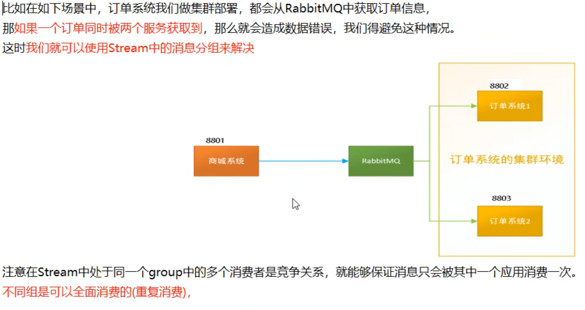

解决的话就是配置成相同的组，这样就一人消费一条了，没啥软用，还是用rabbitmq的交换机和routing-key去解决吧

这个重复消费的笔记别看了，老师讲的有点绕

持久化这里就是指宕机后也能再次接收到生产方在宕机阶段发的东西，只要在yml文件中配置了上面说的group属性，就能持久化了

总结就是stream都不知道说啥好   

