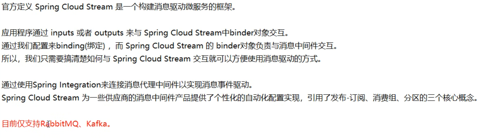
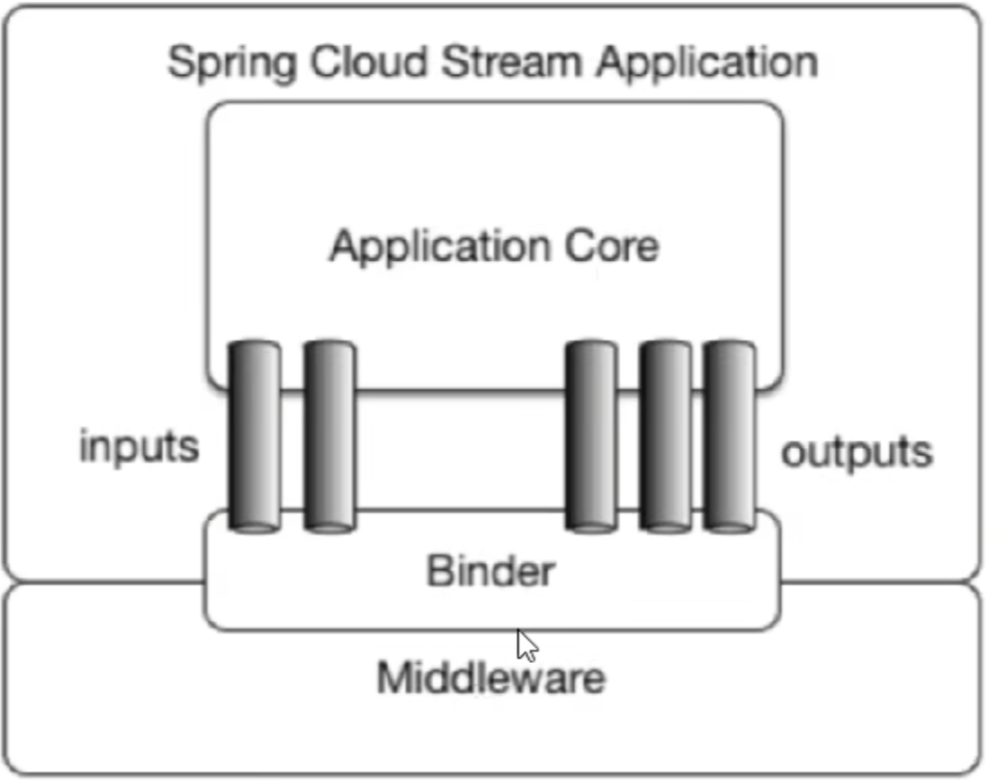
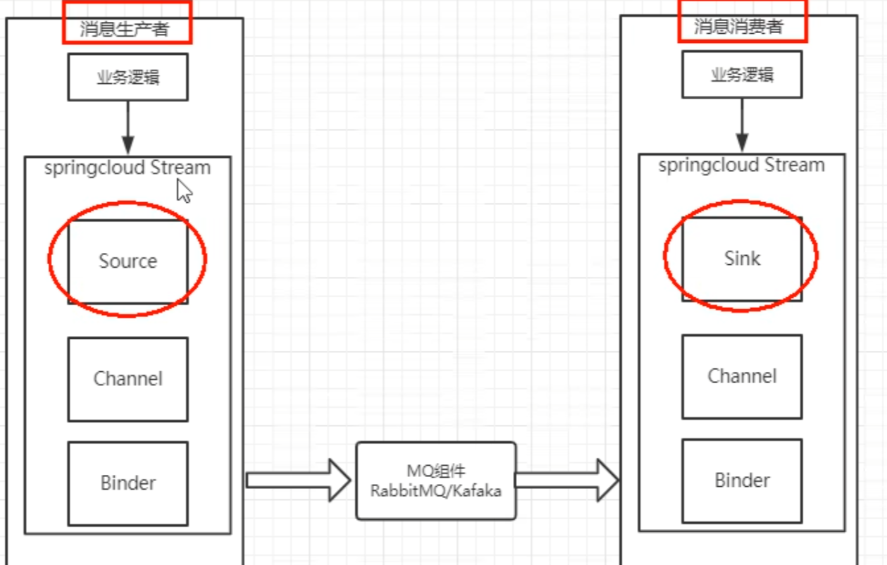
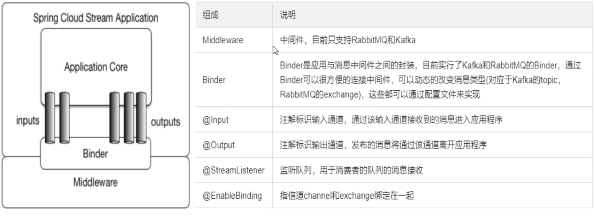
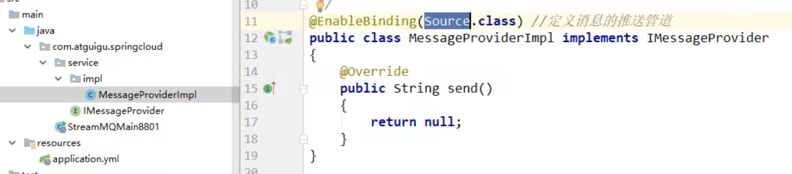
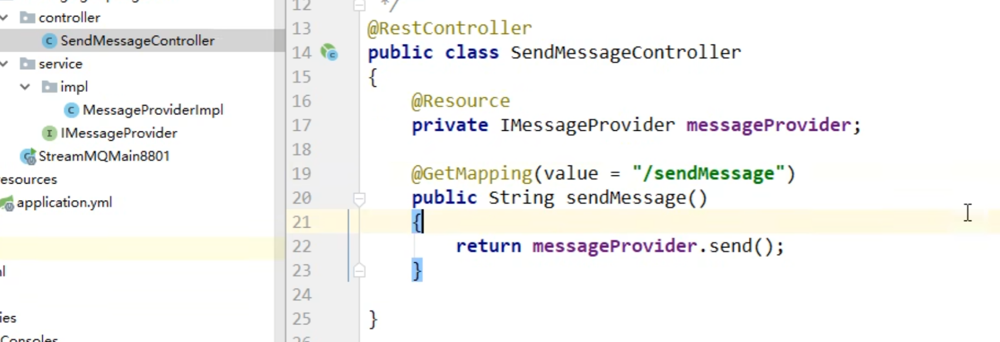
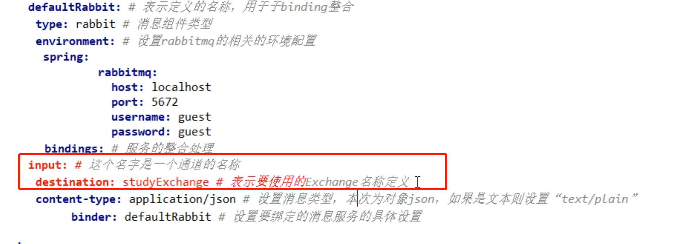
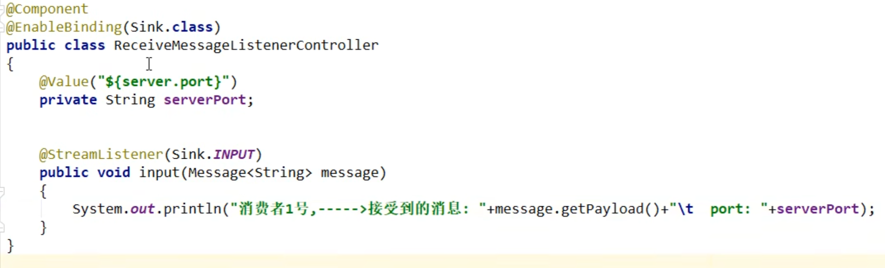

### 什么是stream     
    
    
inputs就是消费者，outputs就是生产者   

### 编码常用注解   
   

Binder:绑定器，方便连接中间件，屏蔽差异，rabbitmq中的交换机      
channel: 类似中间件中的队列,通过channel对队列进行配置      
Source和Sink  
     

然后是要用到的注解   
      

# 实战   

pom文件  
   
如果要切换成kafka只要pom文件最后rabbit改成kafka就行了   

yml文件   
     

## 生产者模块

#### 业务

##### 发送消息接口  
   

##### 发送消息接口实现类   
开发套路：       

流程1： Source      
       
加上注解，知道理论知识然后进行实操   
生产者这边得有Source，然后要用信道  和 绑定器连接消息中间件   

于是我们就用到了@EnableBinding将channel和Exchange绑定在一起    

这个@EnableBinding就是框架图中的Outputs   

流程2：配置信道 channel  
   

    

##### Controller  

就调用下之前写的类的方法就好了   
   

## 消费者模块   
yml文件要把output改为input   
    

#### 业务  

      

发送消息的时候，是String类型的message，消费的时候，也要是String，所以Message<String>   

