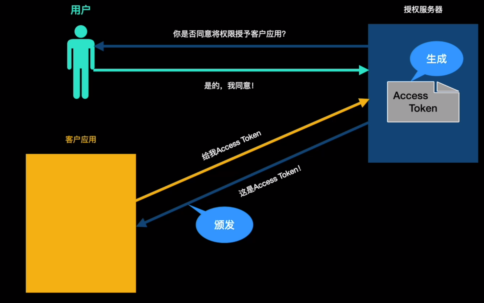

为了防止恶意用户去得到资源服务器中的信息去做坏事，所以要有微服务授权和验证系统    

    

实际场景中，不是授权服务器直接颁发Access Token的，是需要先经过用户同意后才给Access Token    

   

上图就是Oauth2.0最核心的内容   

Oauth2.0的两个核心：请求响应和授权模式   
    

客户应用、授权服务、用户三者之间的交互流程如下：

1. 客户应用请求授权服务器获取Access Token
2. 授权服务器咨询用户意见
3. 用户同意授权
4. 授权服务器颁发Access Token 给 客户应用 