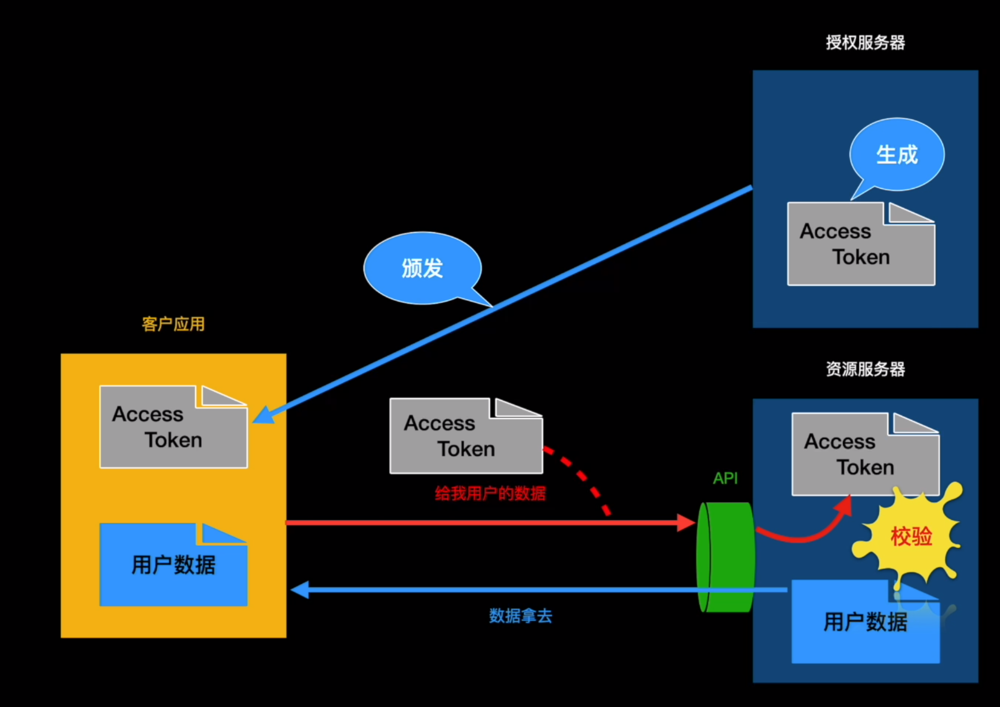
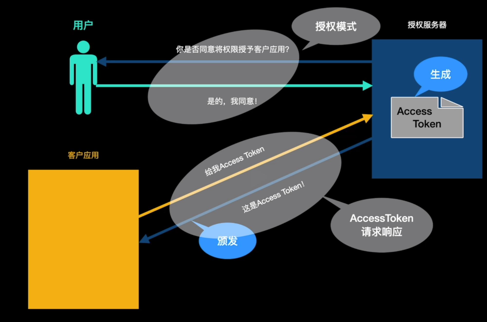

为了防止恶意用户去得到资源服务器中的信息去做坏事，所以要有微服务授权和验证系统    

    

实际场景中，不是授权服务器直接颁发Access Token的，是需要先经过用户同意后才给Access Token    

   

上图就是Oauth2.0最核心的内容   

Oauth2.0的两个核心：请求响应和授权模式   
    

客户应用、授权服务、用户三者之间的交互流程如下：

1. 客户应用请求授权服务器获取Access Token
2. 授权服务器咨询用户意见
3. 用户同意授权
4. 授权服务器颁发Access Token 给 客户应用   

角色
客户端
客户端本身不存储任何的资源，需要通过资源拥有者的授权去请求资源服务器的资源，比如：Andriod客户端、IOS客户端、浏览器端、微信客户端。

资源拥有者
通常为用户，也可以是应用程序，既该资源的拥有者。

授权服务器(认证服务器)
用来对资源拥有者的身份进行认证、对访问资源进行授权。客户端要想访问资源需要通过认证服务器由资源拥有者授权后可访问。

# 常用术语
客户凭证 (client Credentials): 客户端的ClientID和密码用于认证客户。  
令牌(tokens): 授权服务器在接受到用户的请求后，颁发的访问令牌       
作用域(scopes): 客户请求访问令牌时，由资源拥有者额外制定的细分权限。   
# 常用令牌
授权码：仅用于授权码授权类型，用于交换获取访问令牌和刷新令牌    
访问令牌：用于代表一个用户或服务直接去访问受保护的资源     
刷新令牌：用于去授权服务器获取一个刷新访问令牌   
BearerToken ：不管谁拿到Token都可以访问资源，类似现金   
Proof of Possession (Pop) Token：可以校验 client 是否对Token有明确的拥有权    

# 优点
更安全，客户端不接触用户密码，服务器端更易集中保护    
广泛传播并被持续采用   
短寿命和封装的token   
资源服务器和授杈服务器解耦    
集中式授权，简化客户端   
HTTP/JSON友好，易于请求和传递token    
考虑多种客户端架构场景   
客户可以具有不同的信任级别        

# 缺点
协议框架太竞泛，造成各种实现的兼容性和互操作性差    
只是一个认证协议，本身并不能告诉你任何用户信息。   