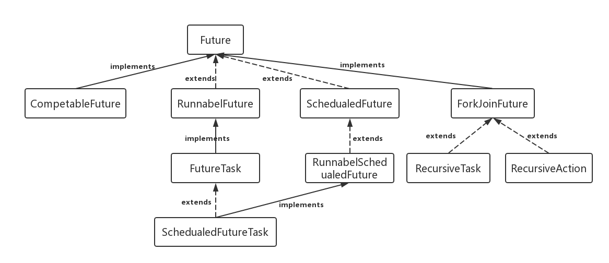
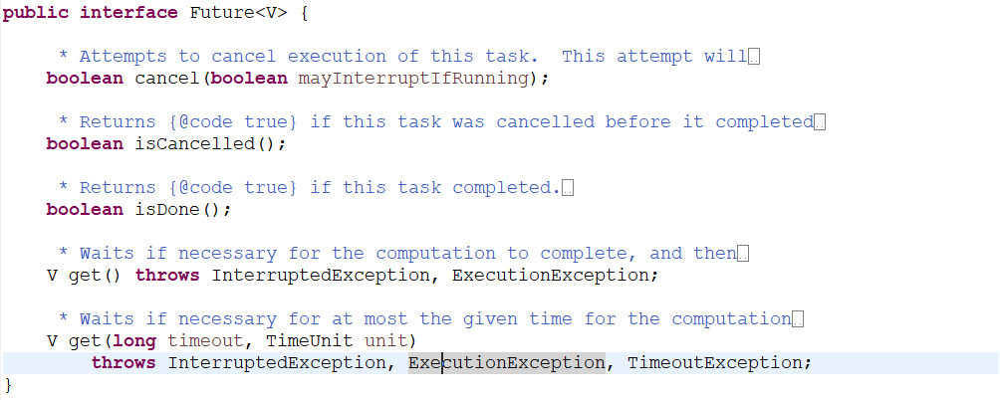

# Future类  

### 1. Future的应用场景

在并发编程中，我们经常用到非阻塞的模型，在之前的多线程的三种实现中，不管是继承thread类还是实现runnable接口，都无法保证获取到之前的执行结果。通过实现Callback接口，并用Future可以来接收多线程的执行结果。   
Future表示一个可能还没有完成的异步任务的结果，针对这个结果可以添加Callback以便在任务执行成功或失败后作出相应的操作。   
举个例子：比如去吃早点时，点了包子和凉菜，包子需要等3分钟，凉菜只需1分钟，如果是串行的一个执行，在吃上早点的时候需要等待4分钟，但是因为你在等包子的时候，可以同时准备凉菜，所以在准备凉菜的过程中，可以同时准备包子，这样只需要等待3分钟。那Future这种模式就是后面这种执行模式。     


### 2. Future的类图结构
   Future接口定义了主要的5个接口方法，有RunnableFuture和SchedualFuture继承这个接口，以及CompleteFuture和ForkJoinTask继承这个接口。

    

RunnableFuture

        这个接口同时继承Future接口和Runnable接口，在成功执行run（）方法后，可以通过Future访问执行结果。这个接口都实现类是FutureTask,一个可取消的异步计算，这个类提供了Future的基本实现，后面我们的demo也是用这个类实现，它实现了启动和取消一个计算，查询这个计算是否已完成，恢复计算结果。计算的结果只能在计算已经完成的情况下恢复。如果计算没有完成，get方法会阻塞，一旦计算完成，这个计算将不能被重启和取消，除非调用runAndReset方法。

        FutureTask能用来包装一个Callable或Runnable对象，因为它实现了Runnable接口，而且它能被传递到Executor进行执行。为了提供单例类，这个类在创建自定义的工作类时提供了protected构造函数。

SchedualFuture

        这个接口表示一个延时的行为可以被取消。通常一个安排好的future是定时任务SchedualedExecutorService的结果

CompleteFuture

        一个Future类是显示的完成，而且能被用作一个完成等级，通过它的完成触发支持的依赖函数和行为。当两个或多个线程要执行完成或取消操作时，只有一个能够成功。

ForkJoinTask

        基于任务的抽象类，可以通过ForkJoinPool来执行。一个ForkJoinTask是类似于线程实体，但是相对于线程实体是轻量级的。大量的任务和子任务会被ForkJoinPool池中的真实线程挂起来，以某些使用限制为代价。


### 3. Future的主要方法
   Future接口主要包括5个方法
     


cancel（boolean mayInterruptIfRunning）方法可以用来停止一个任务，如果任务可以停止（通过mayInterruptIfRunning来进行判断），则可以返回true,如果任务已经完成或者已经停止，或者这个任务无法停止，则会返回false.

isCancel（）方法判断当前方法是否取消


isDone（）方法判断当前方法是否完成


get（）方法可以当任务结束后返回一个结果，如果调用时，工作还没有结束，则会阻塞线程，直到任务执行完毕

get（long timeout,TimeUnit unit）做多等待timeout的时间就会返回结果

### 4. Future示例demo
   需求场景：等早餐过程中，包子需要3秒，凉菜需要1秒，普通的多线程需要四秒才能完成。先等凉菜，再等包子，因为等凉菜时，普通多线程启动start()方法，执行run()中具体方法时，没有返回结果，所以如果要等有返回结果，必须是要1秒结束后才知道结果。

普通多线程：

```java

public class BumThread extends Thread{
	
	@Override
	public void run() {
		try {
			Thread.sleep(1000*3);
			System.out.println("包子准备完毕");
		} catch (InterruptedException e) {
			e.printStackTrace();
		}
	}
 
}

```

```java

public class ColdDishThread extends Thread{
	
	@Override
	public void run() {
		try {
			Thread.sleep(1000);
			System.out.println("凉菜准备完毕");
		} catch (InterruptedException e) {
			e.printStackTrace();
		}
	}
 
}
```
```java

public static void main(String[] args) throws InterruptedException {
		long start = System.currentTimeMillis();
		
		// 等凉菜 -- 必须要等待返回的结果，所以要调用join方法
		Thread t1 = new ColdDishThread();
		t1.start();
		t1.join();
		
		// 等包子 -- 必须要等待返回的结果，所以要调用join方法
		Thread t2 = new BumThread();
		t2.start();
		t2.join();
		
		long end = System.currentTimeMillis();
		System.out.println("准备完毕时间："+(end-start));
	}
```

#### 采用Future模式：
```java

	public static void main(String[] args) throws InterruptedException, ExecutionException {
    long start = System.currentTimeMills; 
    //等凉菜
    Callable cal = new Callable(){
    @Override
    public String call() throws Exception {
            try {
            Thread.sleep(1000);
            } catch (InterruptedException e) {
            e.printStackTrace();
            }
            return "凉菜准备完毕";
    };
    FutureTask<String> ft1 = new FutureTask<String>(cal);
            new Thread(ft1).start();

            // 等包子
            Callable ca2 = new Callable(){

    @Override
    public Object call() throws Exception {
            try {
            Thread.sleep(1000*3);
            } catch (InterruptedException e) {
            e.printStackTrace();
            }
            return "包子准备完毕";
            }
            };
            FutureTask<String> ft2 = new FutureTask<String>(ca2);
            new Thread(ft2).start();

            System.out.println(ft1.get());
            System.out.println(ft2.get());

            long end = System.currentTimeMillis();
            System.out.println("准备完毕时间："+(end-start));
    
}
```


版权声明：本文为CSDN博主「石硕页」的原创文章，遵循CC 4.0 BY-SA版权协议，转载请附上原文出处链接及本声明。
原文链接：https://blog.csdn.net/u014209205/article/details/80598209 